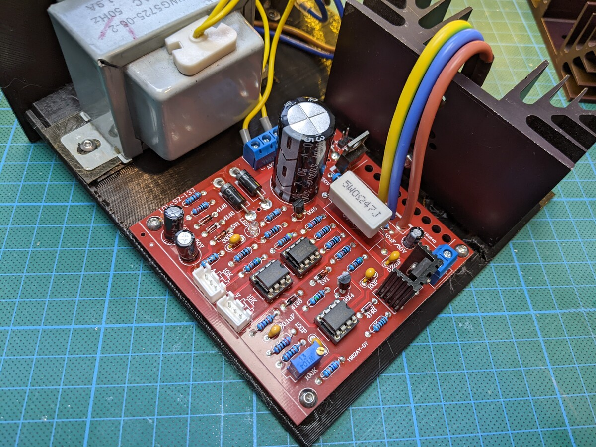
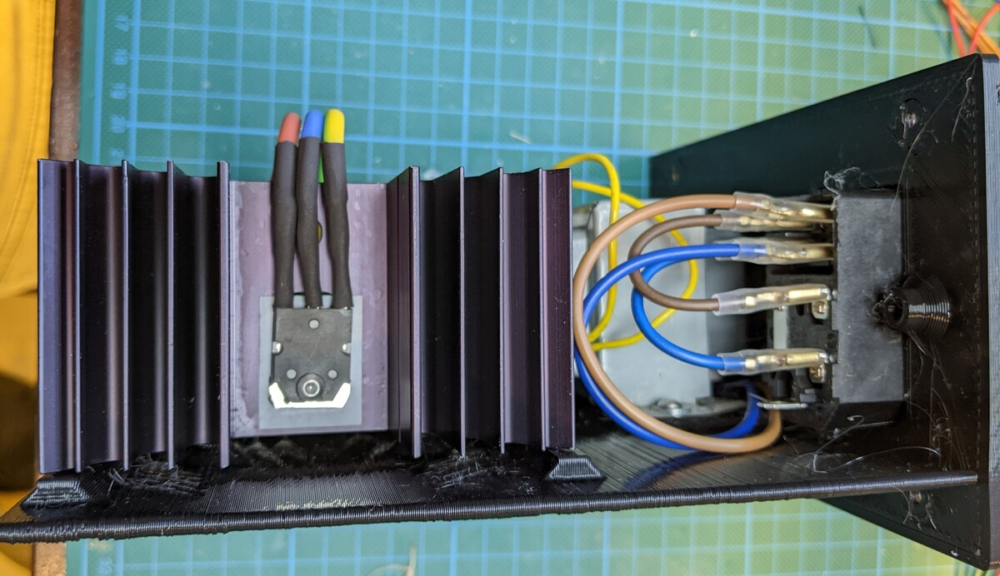
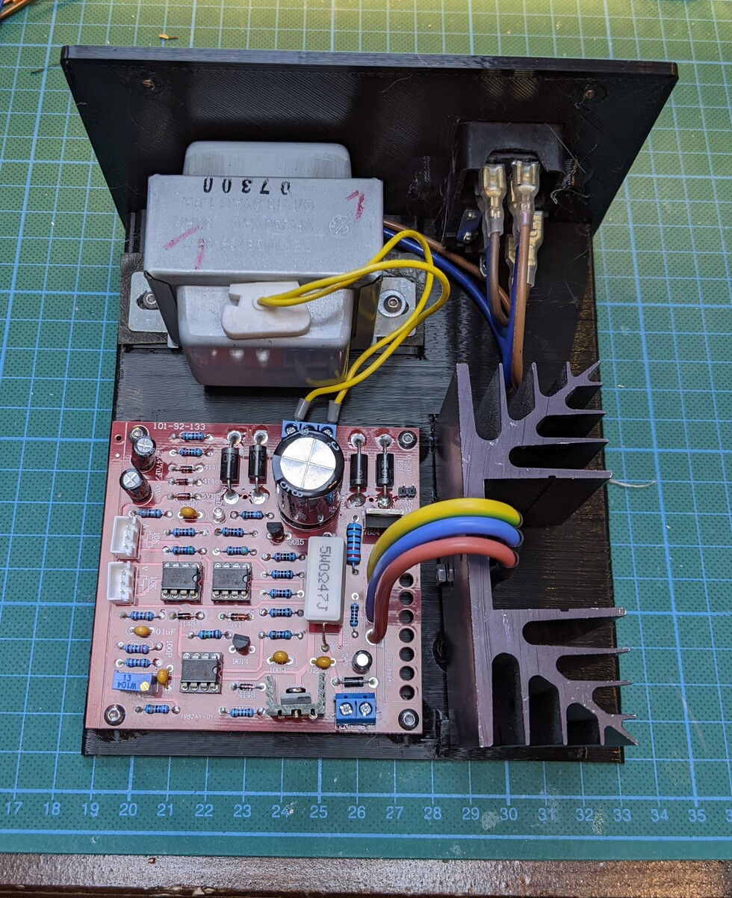
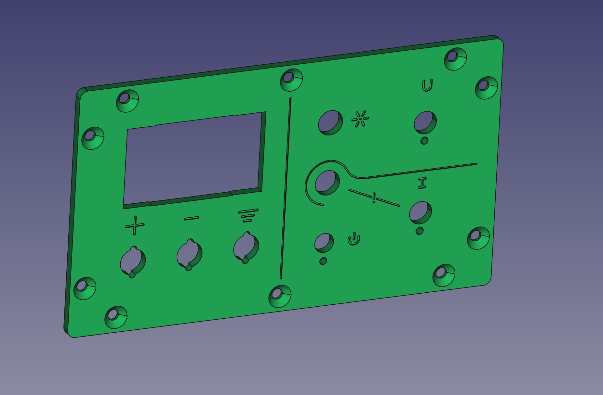
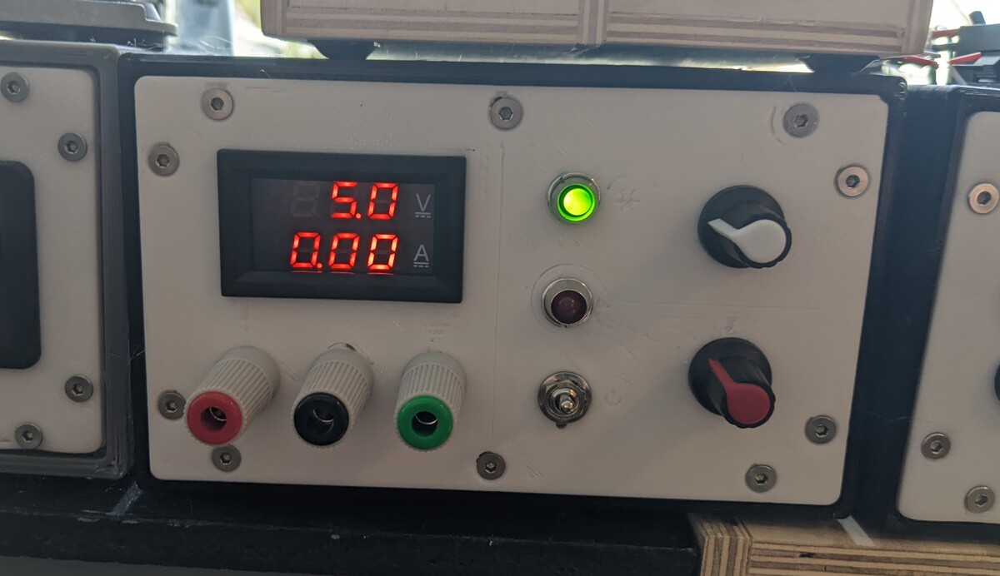

Once upon a time, I disassembled a 2.1 channel audio set made by logitech. Several components were missing, like the cabled remote-controller thingy, the two stereo speakers and most of the cabling. Actually, all that was left was the active sub woofer, making it more of a 0.1 channel audio set.

## Images

# References
