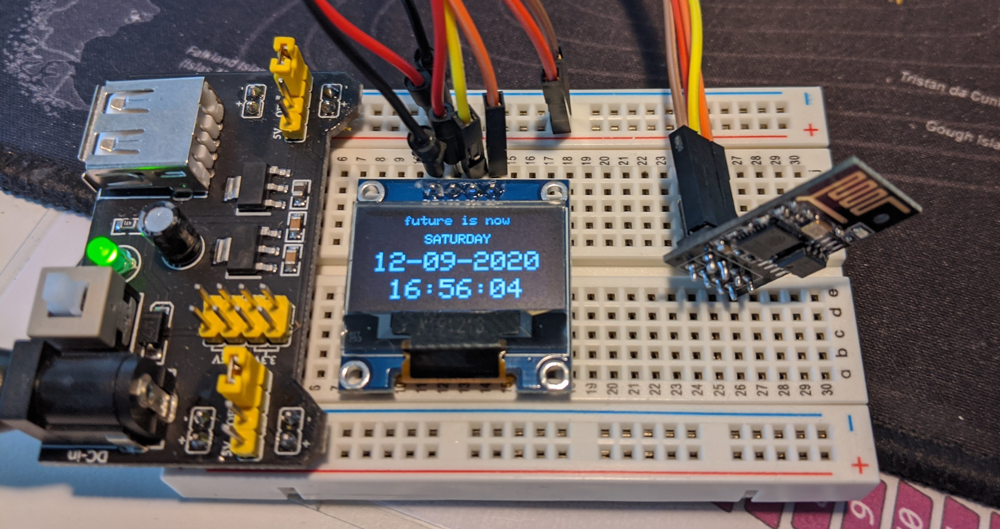

I've recently started to get really interested in micro controllers, mainly Arduinos (and their clones). The ESP8266 and similar are a different beast however, because they have _a lot_ more memory, storage and higher clock rate. And of course, they're wifi capable.

So of course, I tried to build the most basic project imaginable, an internet connected clock. This is it:



It's basic and not really impressive, but it's my first project and I like it.

## Code

Credit where credit is due: almost all of the code is ~~shamelessly stolen from~~ inspired by [simple-circuit.com](https://simple-circuit.com/iot-nodemcu-internet-clock-ssd1306/). Don't judge, it's my first project! But hey, there is also some own work of mine in here; I had to add this line to make my specimen work:

### SSD1306 Compatibility

```cpp
#define OLED_RESET LED_BUILTIN
```

### Full Code

This is the entire code:

```cpp
/**************************************************************************************

 WiFi Internet clock (NTP) with ESP8266 NodeMCU (ESP-12E) and SSD1306 OLED display
 This is a free software with NO WARRANTY.
 http://simple-circuit.com/

***************************************************************************************/

#include <ESP8266WiFi.h>
#include <WiFiUdp.h>
#include <NTPClient.h>               // include NTPClient library
#include <TimeLib.h>                 // include Arduino time library

// Libraries for SSD1306 OLED display
#include <Wire.h>              // include wire library (for I2C devices such as SSD1306 display)
#include <Adafruit_GFX.h>      // include Adafruit graphics library
#include <Adafruit_SSD1306.h>  // include Adafruit SSD1306 OLED display driver

#define SCREEN_WIDTH 128 // OLED display width, in pixels
#define SCREEN_HEIGHT 64 // OLED display height, in pixels

// Declaration for an SSD1306 display connected to I2C (SDA, SCL pins)
#define OLED_RESET LED_BUILTIN
Adafruit_SSD1306 display(SCREEN_WIDTH, SCREEN_HEIGHT, &Wire, OLED_RESET);


const char *ssid     = "MY-SSID";
const char *password = "MY-SUPER-SECRET-WIFI-PASSWORD";
char wiFiHostname[] = "Magic ESP Clock";

WiFiUDP ntpUDP;

// 'time.nist.gov' is used (default server) with +1 hour offset (3600 seconds) 60 seconds (60000 milliseconds) update interval
NTPClient timeClient(ntpUDP, "time.nist.gov", 2*3600, 60000);

void setup(void)
{

  Serial.begin(9600);
  delay(1000);

  Wire.begin(4, 0);           // set I2C pins [SDA = GPIO4 (D2), SCL = GPIO0 (D3)], default clock is 100kHz

  // by default, we'll generate the high voltage from the 3.3v line internally! (neat!)
  display.begin(SSD1306_SWITCHCAPVCC, 0x3C);  // initialize with the I2C addr 0x3D (for the 128x64)
  // init done

//  Wire.setClock(400000L);   // set I2C clock to 400kHz

  display.clearDisplay();  // clear the display buffer.
  display.setTextColor(WHITE, BLACK);
  draw_text(24, 0, "future is now", 1);
  display.display();

  WiFi.begin(ssid, password);

  Serial.print("Connecting.");
  while ( WiFi.status() != WL_CONNECTED ) {
    delay(500);
    Serial.print(".");
  }
  Serial.println("connected");

  timeClient.begin();

}

char Time[] = "  :  :  ";
char Date[] = "  -  -20  ";
byte last_second, second_, minute_, hour_, wday, day_, month_, year_;

void loop()
{
  timeClient.update();
  unsigned long unix_epoch = timeClient.getEpochTime();   // get UNIX Epoch time

  second_ = second(unix_epoch);        // get seconds from the UNIX Epoch time
  if (last_second != second_)
  {
    minute_ = minute(unix_epoch);      // get minutes (0 - 59)
    hour_   = hour(unix_epoch);        // get hours   (0 - 23)
    wday    = weekday(unix_epoch);     // get minutes (1 - 7 with Sunday is day 1)
    day_    = day(unix_epoch);         // get month day (1 - 31, depends on month)
    month_  = month(unix_epoch);       // get month (1 - 12 with Jan is month 1)
    year_   = year(unix_epoch) - 2000; // get year with 4 digits - 2000 results 2 digits year (ex: 2018 --> 18)

    Time[7] = second_ % 10 + '0';
    Time[6] = second_ / 10 + '0';
    Time[4] = minute_ % 10 + '0';
    Time[3] = minute_ / 10 + '0';
    Time[1] = hour_   % 10 + '0';
    Time[0] = hour_   / 10 + '0';
    Date[9] = year_   % 10 + '0';
    Date[8] = year_   / 10 + '0';
    Date[4] = month_  % 10 + '0';
    Date[3] = month_  / 10 + '0';
    Date[1] = day_    % 10 + '0';
    Date[0] = day_    / 10 + '0';

    display_wday();
    draw_text(4,  29, Date, 2);        // display date (format: dd-mm-yyyy)
    draw_text(16, 50, Time, 2);        // display time (format: hh:mm:ss)
    display.display();
    last_second = second_;

  }

  delay(200);

}

void display_wday()
{
  switch(wday){
    case 1:  draw_text(40, 15, " SUNDAY  ", 1); break;
    case 2:  draw_text(40, 15, " MONDAY  ", 1); break;
    case 3:  draw_text(40, 15, " TUESDAY ", 1); break;
    case 4:  draw_text(40, 15, "WEDNESDAY", 1); break;
    case 5:  draw_text(40, 15, "THURSDAY ", 1); break;
    case 6:  draw_text(40, 15, " FRIDAY  ", 1); break;
    default: draw_text(40, 15, "SATURDAY ", 1);
  }
}

void draw_text(byte x_pos, byte y_pos, char *text, byte text_size)
{
  display.setCursor(x_pos, y_pos);
  display.setTextSize(text_size);
  display.print(text);
}
// End of code.
```

So while this project is neither very original nor inventive, I'm sure there are more projects to come.
