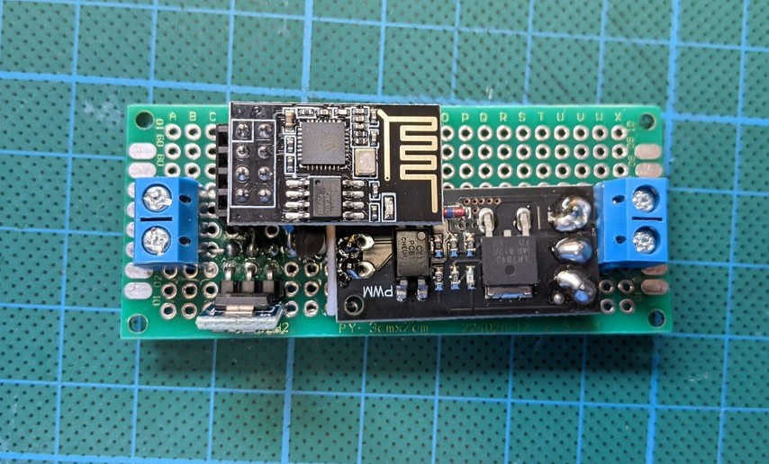
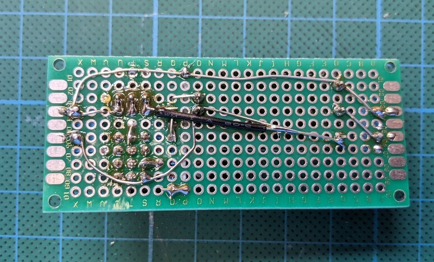
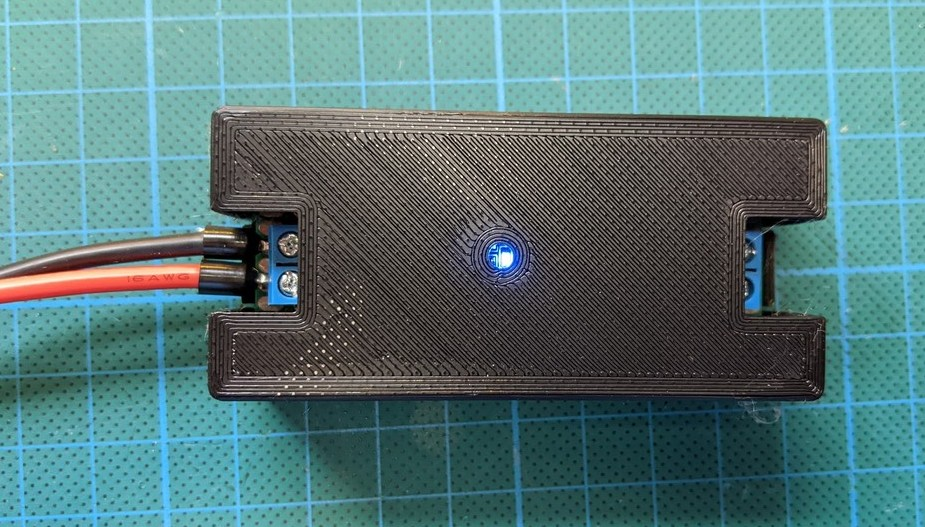
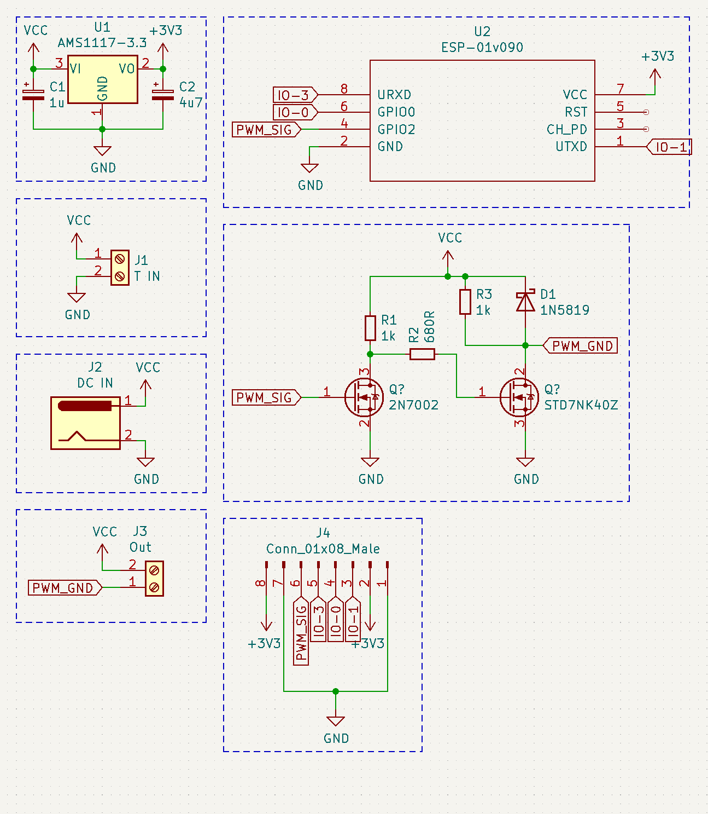
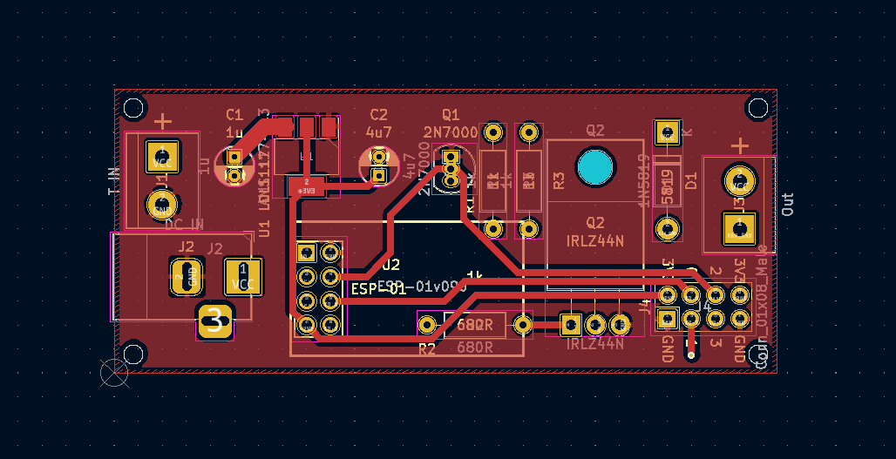
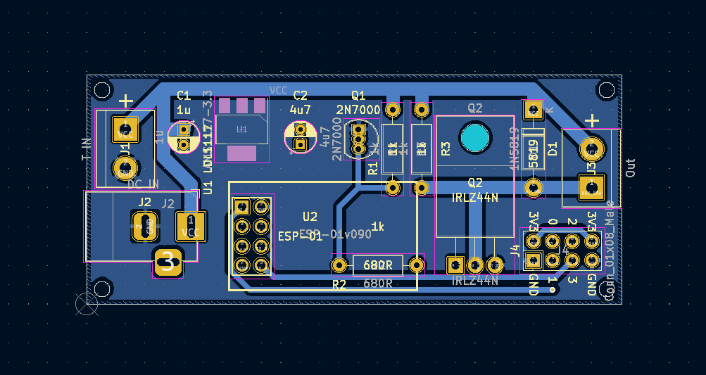
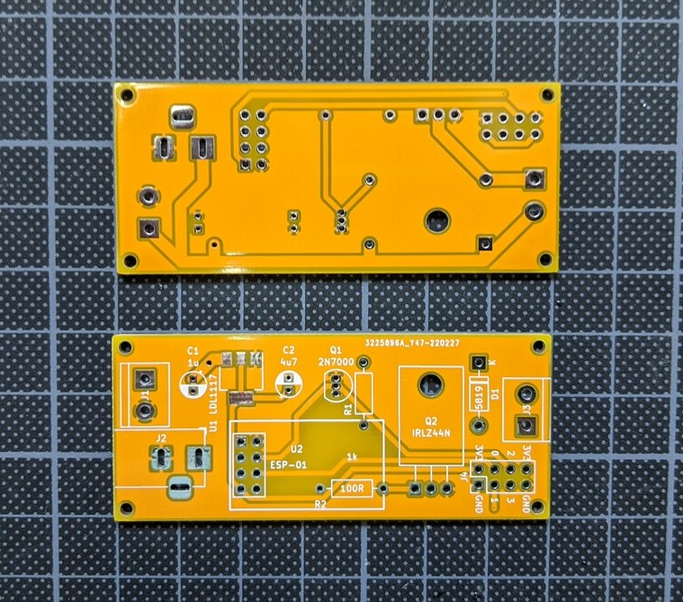
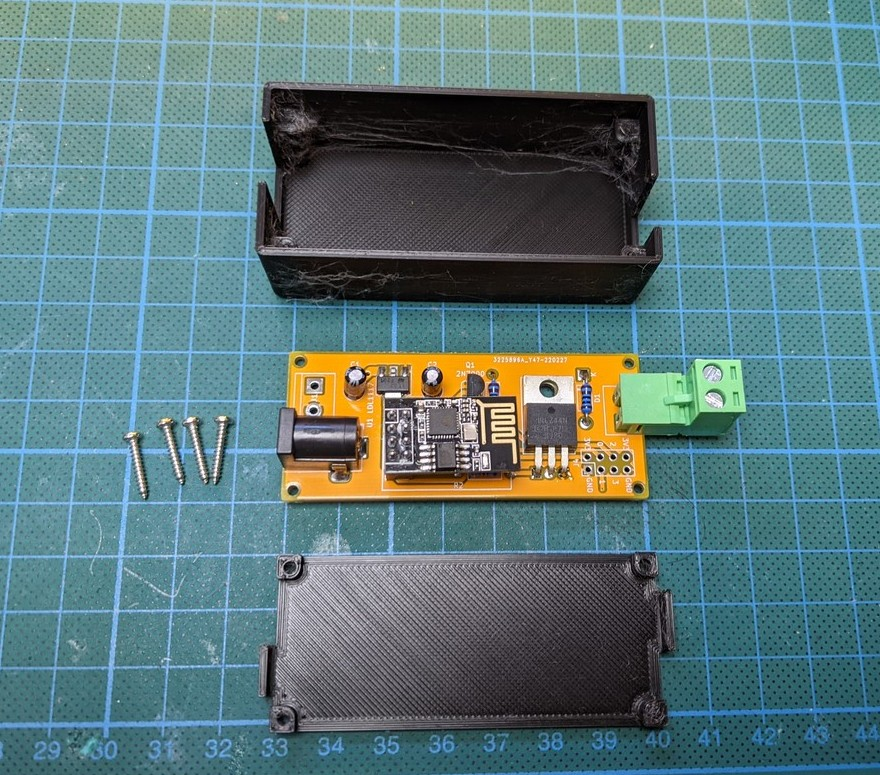
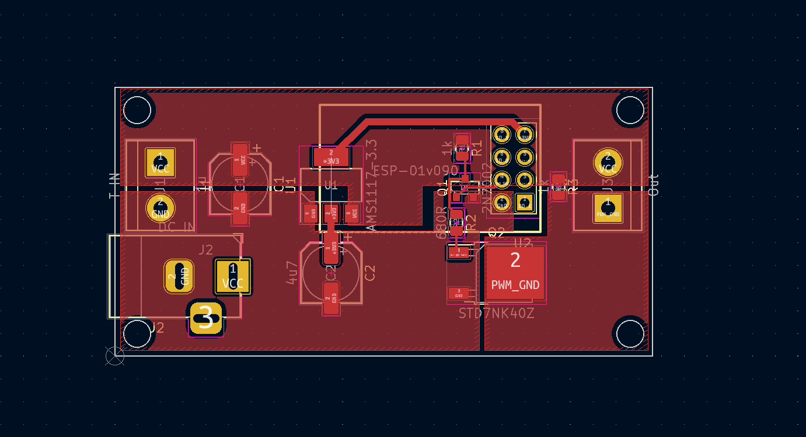
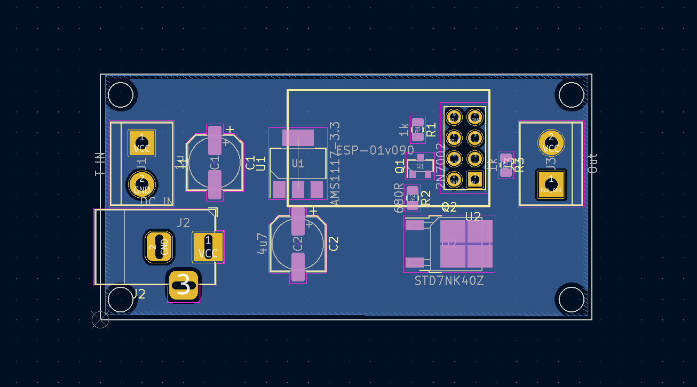

Why buy something that works when you can build it yourself fot twice the price?

## First manual attempt







## A bit more professionalism, please!











## Second Version, not produced yet.





## Tasmota Template

```
{"NAME":"ESP01-DimmerRK","GPIO":[1,1,416,1,1,1,1,1,1,1,1,1,1,1],"FLAG":0,"BASE":18}
```

# References