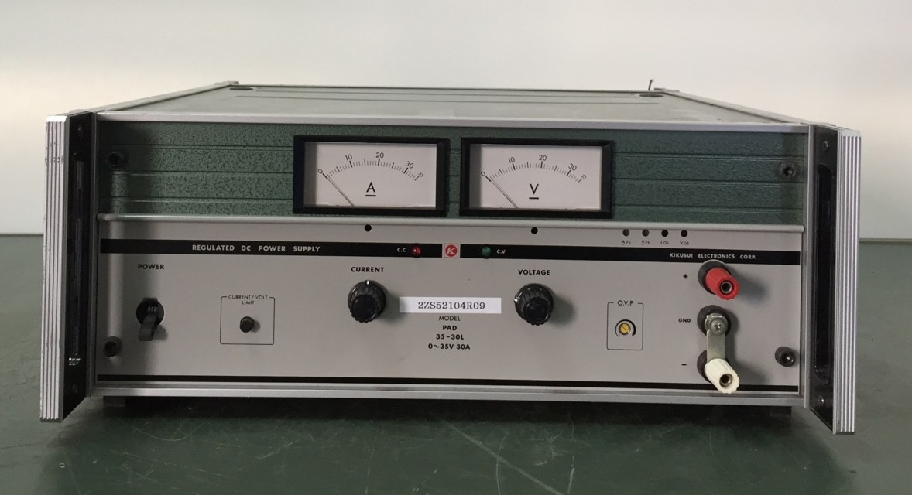
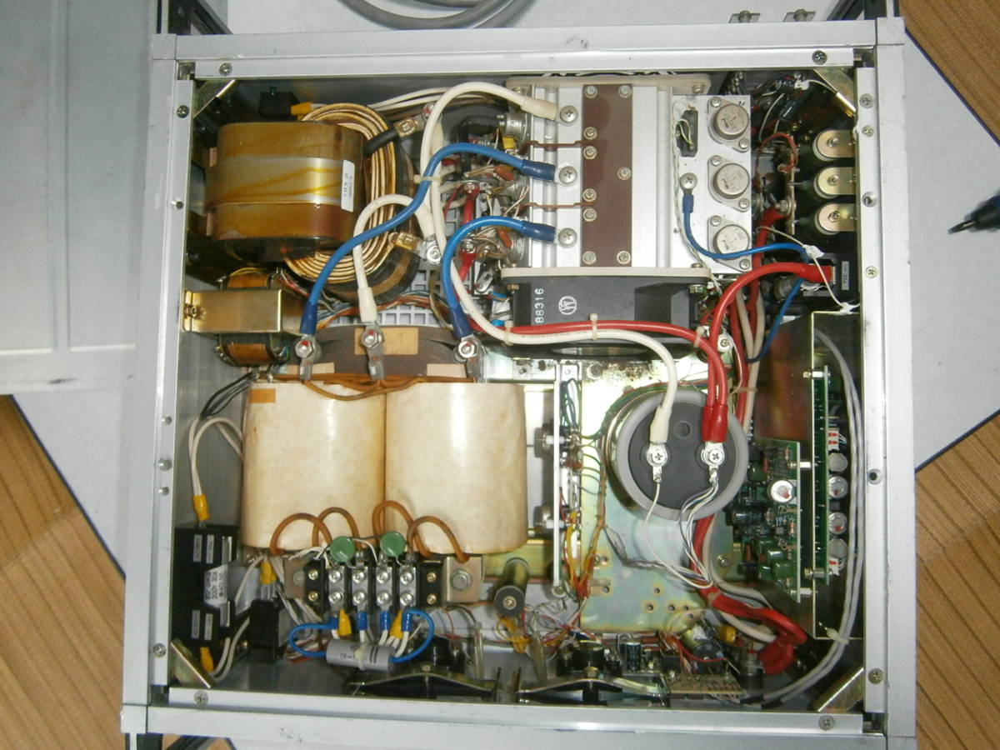
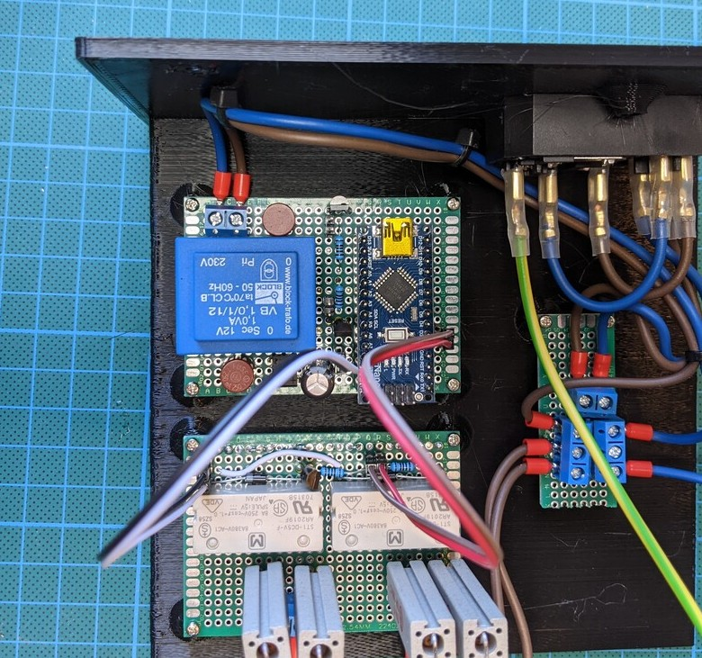
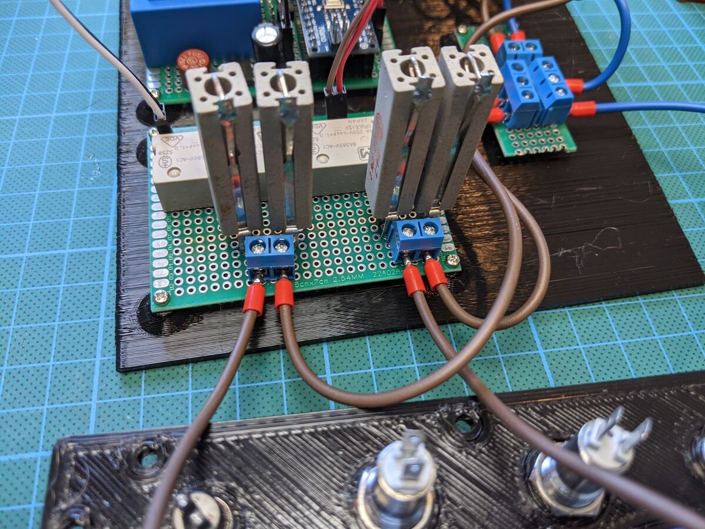
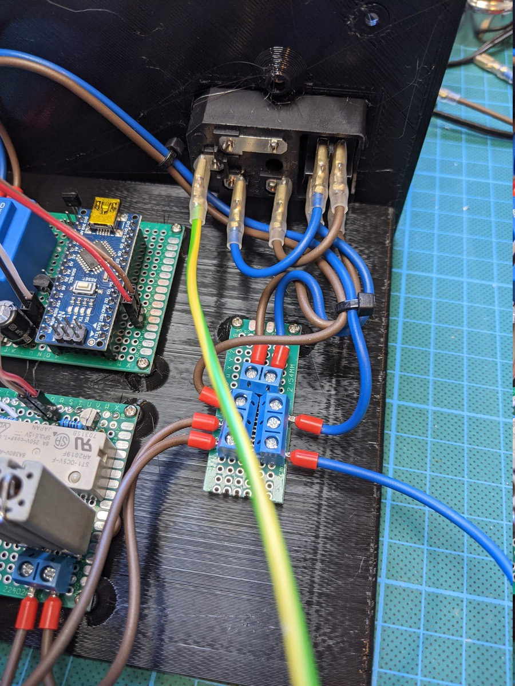
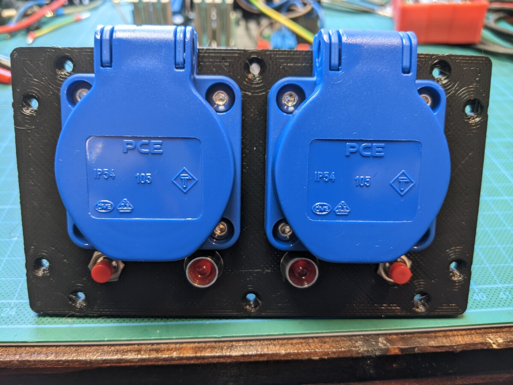
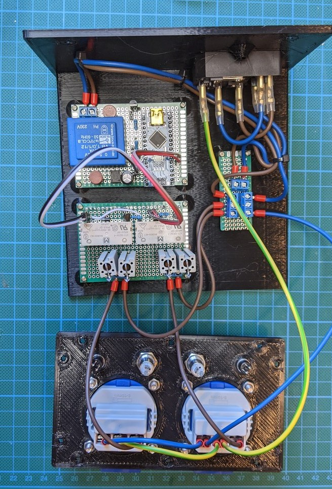
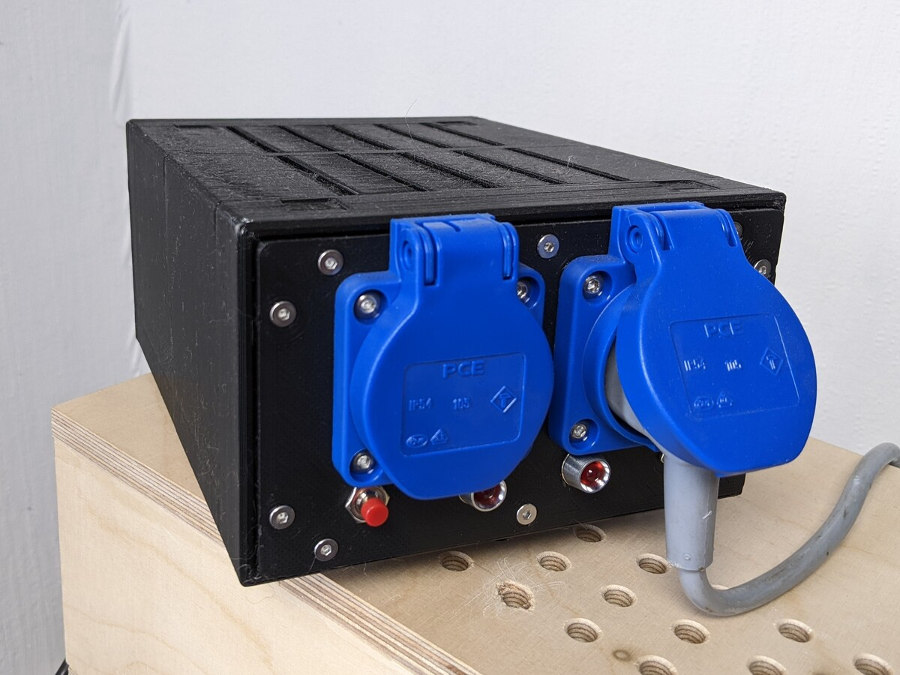

<script>
    document.addEventListener("DOMContentLoaded", function() {
        renderMathInElement(document.body, {
            delimiters: [
                {left: "$$", right: "$$", display: true},
                {left: "$", right: "$", display: false}
            ]
        });
    });
</script>


# Preamble

A few years ago I got an old linear power supply that was decommissioned at work: a Kikusui PAD 35-30L.



This thing is a behemoth. It weighs just over 30 kg, is as large as a 3U server and can deliver over a kilowatt of power, 30 amperes at a maximum of 35 volts. If you're somewhat familiar with switching power supplies, a kilowatt may not actually sound all that much, given that a good computer PSU will have a similar output power.

But those are switch mode power supplies. This here is a linear power supply. Simplified, that means it has a transformer that steps down the mains voltage of 230 volts to something like 40 volts, and rectifies and smooths that. To get lower voltages than that from the output of the device, a transistor is placed before the output that acts like an adjustable [voltage divider](https://en.wikipedia.org/wiki/Voltage_divider)


That means if you want 5 volts out, 35 volts have to be "removed" by this transistor. For small currents that is not actually a problem (and is still commonly done this way), but for large currents this wastes a lof of energy, because the dissipated energy is voltage times current:

$P = U \cdot I$

That means two things:

- If you want a low output voltage but large output current, _a lot_ of power ist wasted (dissipated in the transistor)
- The transformer that supplies $$V_in$$ for this "voltage divider" has to be huge.

How huge? Well, see for yourself:



Which leads us to the actual problem I need to solve. The large transformer has a large iron yoke, which results in a large [remanance](https://en.wikipedia.org/wiki/Remanence). This remanence is kind of like stored magnetic energy in the transformer, and unfortunately it doesn't vanish once the transformer is off. When the transformer is switched on later, it may happen at a phase in the AC such that the magnetic field that needs to be built up _now_ is exactly opposed to the remnant magnetic field in the transformer. To overcome that, a large current flows. Much more that a 16 ampere fuse can deliver.

Which blows my fuses.

The way around that is very simple: add a variable resistor in the current path of the primary winding of the transformer to limit this inrushing current. There are multiple ways this is typically done, like chokes, NTCs or ohmic resistors that are bypassed after the inrush period is over. A choke would have to be very large, and thus expensive. I don't think NTCs are used for such high currents either, so what remains is an ohmic resistor.

## References and Thanks

Big thanks go out to the [post apocalyptic inventor](https://www.youtube.com/@ThePostApocalypticInventor), who faced a similar problem. In [this video](https://youtu.be/S8zTjm61v5Y?feature=shared&t=1392), he also uses in line resistors to limit the current, and realizes the switch off after a given time with a NE555 universal timer. Since there were some minor problems with this timer design, I opted not to use it and use a familiar Arduino Nano (clone) instead.

# Design

The idea is very simple. I'm using a relay to switch the current path from input AC to output AC either through the current limiting resistors, or directly without resistors. The relay is controlled by a micro controller, which simply switches after a few hundred milliseconds. If you thing this is a massive overkill and waste of compute capability, you are probably right. But: it is easy. And this thing won't be mass produced by the millions, I only need one of them. So at some point, easy and working but slight overkill is preferable to the ideal, most perfect solution, that takes longer to implement.

# Images








# Code

```cpp
#include <Arduino.h>

#define LED1 A0
#define LED2 A1
#define RELAY1 2
#define RELAY2 3

void setup() {
    // setup pins
    pinMode(LED1, OUTPUT);
    pinMode(LED2, OUTPUT);
    pinMode(RELAY1, OUTPUT);
    pinMode(RELAY2, OUTPUT);
    pinMode(LED_BUILTIN, OUTPUT);

    // start with both sockets off

    digitalWrite(RELAY1, LOW);
    digitalWrite(RELAY2, LOW);
    digitalWrite(LED_BUILTIN, LOW);

    // switch first socket after 1/4th second
    delay(250);
    digitalWrite(LED1, HIGH);
    digitalWrite(RELAY1, HIGH);

    // switch first socket after another 1/4th second
    delay(250);
    digitalWrite(LED2, HIGH);
    digitalWrite(RELAY2, HIGH);

    // the "we are done" light
    delay(500);
    digitalWrite(LED_BUILTIN, HIGH);
}

void loop() {
    // thje micro controller is pretty much wasted until next switch on
    delay(1000);
}
```

# References
