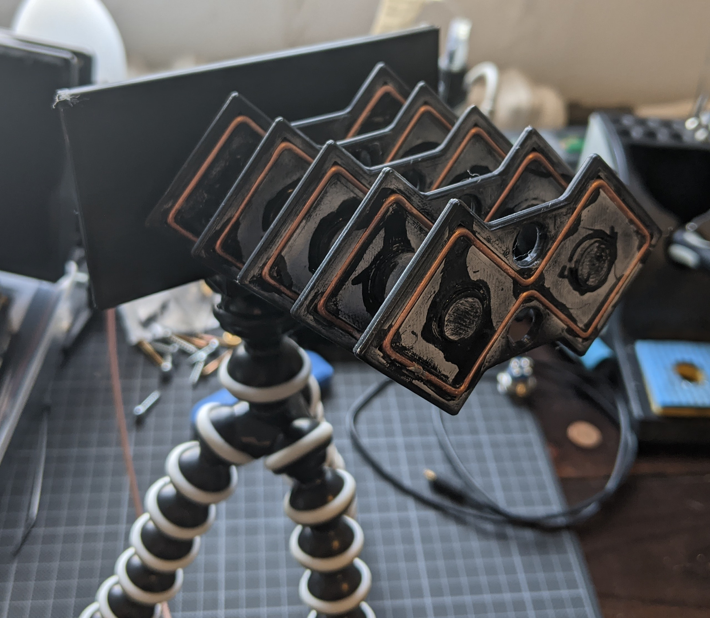
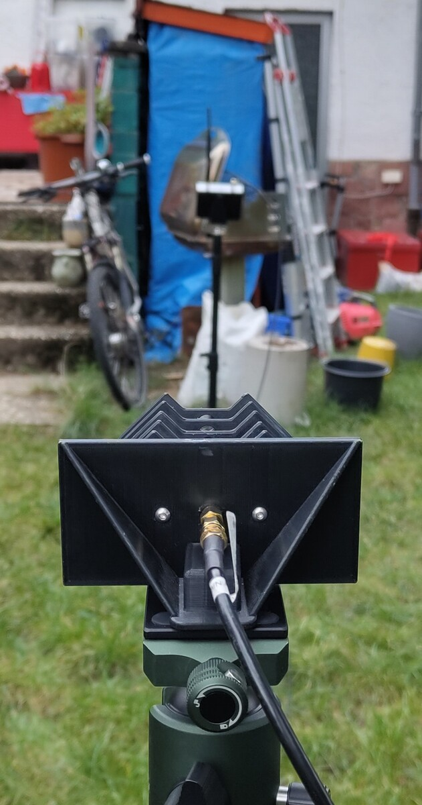
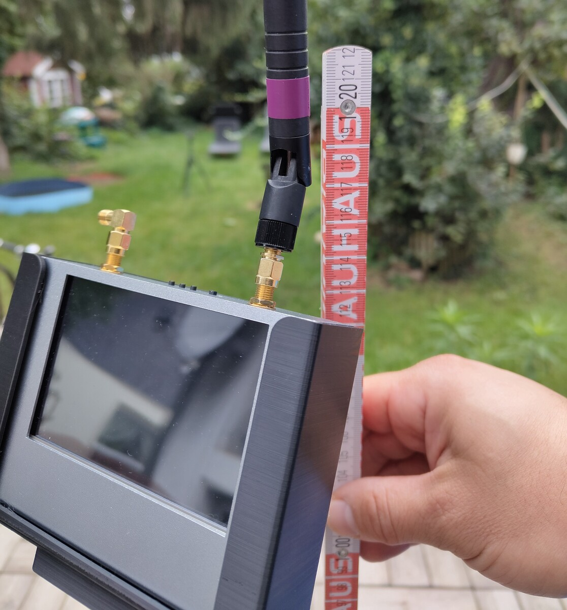
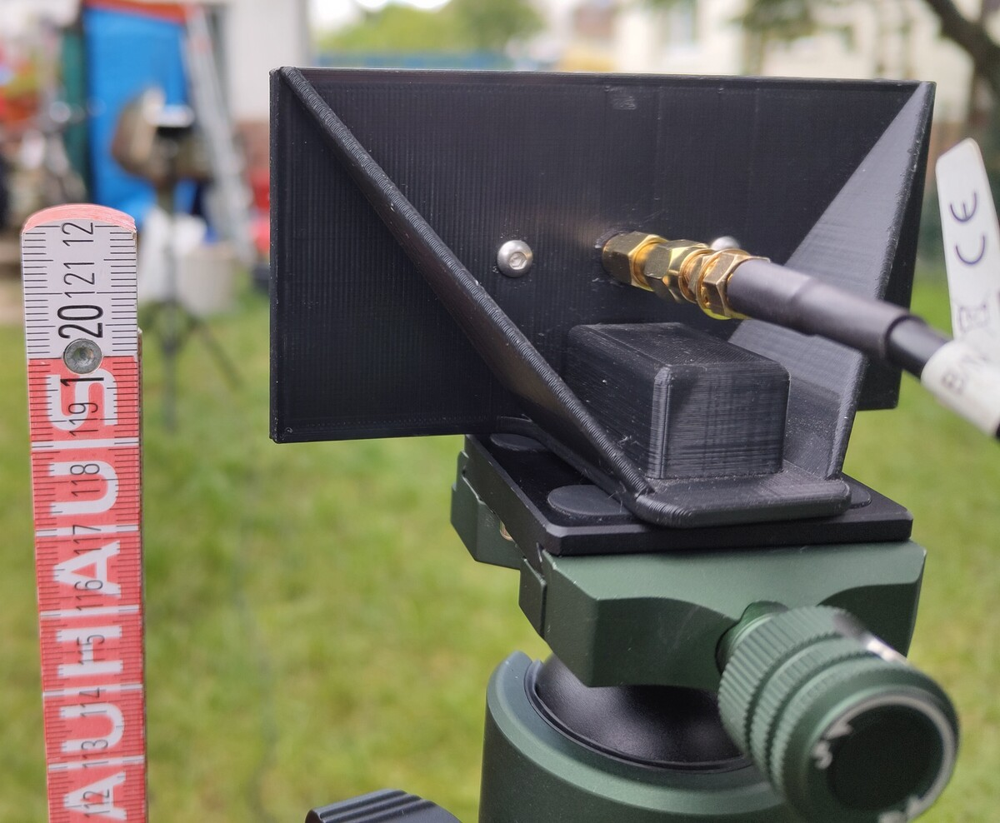
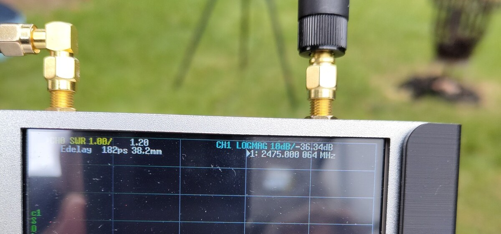
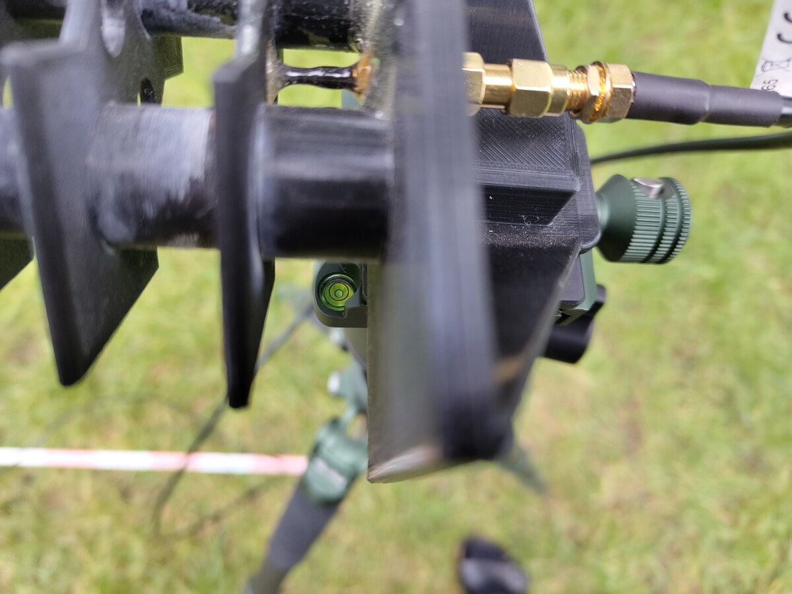
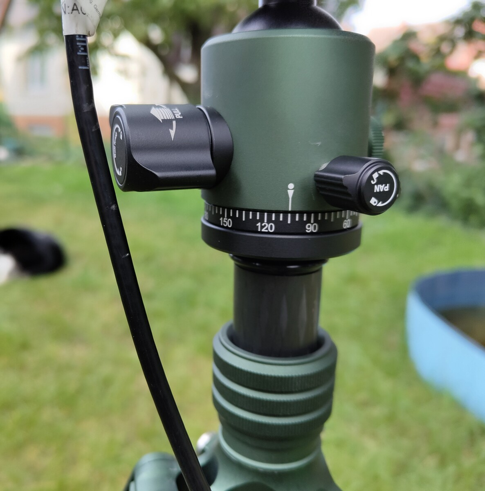
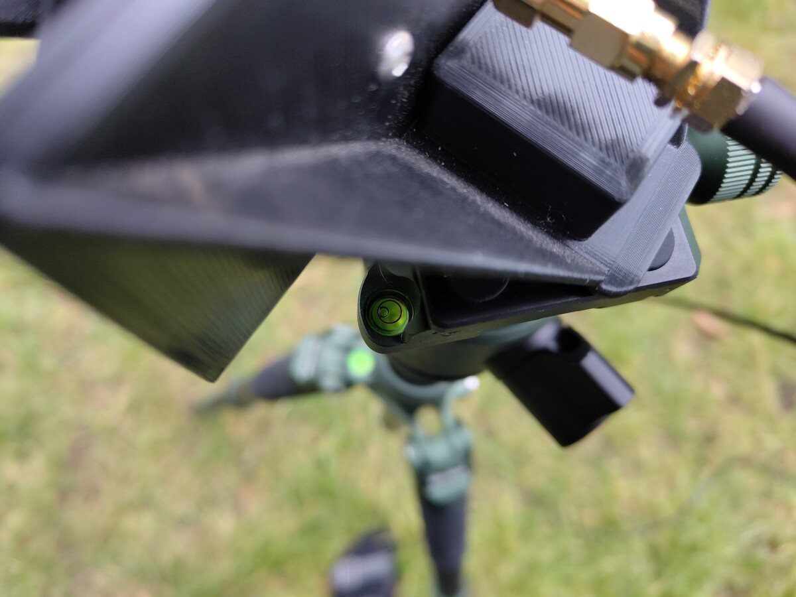
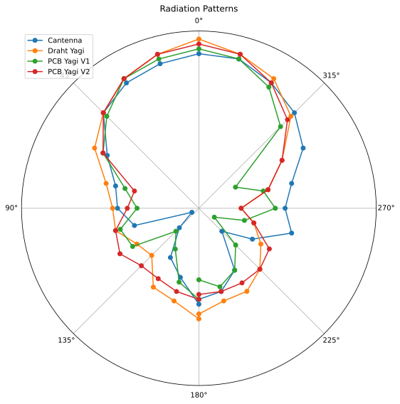
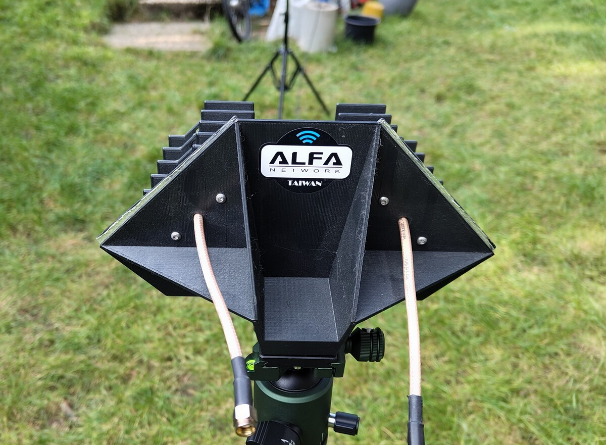

# Preamble

In the past, I have built [a few](../3d-printed-biquad-yagi-antenna) [WiFi antennas](../biquadyagipcb). I have been assured this is completely normal behavior. I have also been assured that it is completely normal to want to know how well they perform. Now, just using them to torrent linux ISOs is fun and all, but most of these antennas are supposed to be highly directional. Watching the torrent speed change while ever so slightly rotating the antenna seemed indirect, inefficient and imprecise. So I decided to measure the radiation patterns of my antennas with my NanoVNA. I have been assured it is completely normal to spend more than 200 Euros for that as long as you call it a "hobby".

It occurred to me much too late that I should probably have simulated at least _one_ of these antennas before building them. I did it the other way round, and you can see my simulations [here](../simulatingantennapatternswithxnec2c/) (or will, it's not ready yet). But I have been assured that it is completely normal to do things the hard way.

## References and Thanks

The PCB Yagis are made from a design by the fantastic [Andrew McNeil](https://www.youtube.com/@andrewmcneil), [his Twitter page](https://twitter.com/andrew__mcneil). I've recreated them in KiCad (two times, because I messed up the dimensions the first time) and had them made by JLCPCB. I've also bought the [Cantenna from him](https://www.ebay.co.uk/str/andrewantennas), but unfortunately he doesn't appear to sell anything anymore.

A lot of credit also goes to OPK who made the STL for the wire based biquad yagi available on [Thingiverse](https://www.thingiverse.com/thing:3130541), who remixed a design by [ReallyBigTeeth](https://www.thingiverse.com/thing:2749265).

# The Setup

The idea is quite simple:

- Setup the antenna to be measured (i.e. the DUT) and the NanoVNA with it's antenna some distance apart
- Use a NanoVNA to measure the S12 parameter of the antenna
- by using a 5m SMA extension cable, the NanoVNA can be placed in the "far" field of the antenna
- and rotating the antenna around it's axis, the relative strength of the signal can be measured
- this giving the radiation pattern of the antenna

## Initial Calibration

I connected the 5m extension cable from port 2 to port 1 and calibrated the NanoVNA. This has to be done each time you change the stimulus (i.e. the frequency range and steps). The actual results are not important, all that's important is that this is now my reference and the resultant S12 values are a flat line across the three values I measured (2450 MHz, 2475 MHz and 2500 MHz). Less values means faster measurements, since I'm only interested in the average anyway. No complete curve is needed.

# Example Measurement

The fist DUT was the very first biquad yagi I build.



## Place both sender and receiver on tripods.

Please excuse the mess, we live here.



## The antennas should be about the same height.

I am a scientist after all.




The maximum value was something like -36.34 dB. For a directional antenna, I expect all other angles to result in a lower signal.



## Make sure the antenna is level

Surely this will stay this way for the whole measurement.



## Rotate the antenna in defined angular steps and have your ~~assistant~~ wife write down the values from the NanoVNA

She assured me this seems like a completely normal Sunday afternoon to her.



## Make sure the antenna is still level after rotating it

I'm sure it's fine.



## Repeat for all antennas and pray your neighbors don't ask questions

They did not.

## End up with a spreadsheet of all measurements

~~Excel~~ LibreOffice makes the world go round.


## Use Jupyter, matplotlib and pandas to plot this

Also goat:

Seriously one of the most useful tools in my toolbox.

```python
import numpy as np
import matplotlib.pyplot as plt
import pandas as pd

def angularPlot(dataFile, name, invert=True, plotname=""):

    if plotname == "":
        plotname = name

    # import ods data with pandas
    df = pd.read_excel(dataFile, engine='odf', skiprows=0, sheet_name=name)

    # convert dataframe to numpy array, cast to float
    data = df.to_numpy().astype(float)

    # if invertis true, invert the second column
    if invert:
        data[:,1] = -data[:,1]

    # sort data by angle
    data = data[data[:,0].argsort()]

    # clip data to -73 db
    data[:,1] = data[:,1].clip(min=-73)

    # polar plot of the data
    fig, ax = plt.subplots(subplot_kw={'projection': 'polar'})
    ax.plot(data[:,0]*np.pi/180, data[:,1], 'o-')
    ax.set_rmax(-30)

    # ticks every 3 db
    ax.set_rticks(np.arange(-73, -30, 5))

    # rotate diagram by 90 degrees
    ax.set_theta_zero_location("N")

    ax.grid(True)
    ax.set_title(f"Radiation Pattern for {plotname}", va='bottom')
    plt.show()

    # make image square
    fig.set_size_inches(5, 5)

    # save to svg
    fig.savefig(f"{plotname}.svg")

# all the plots
angularPlot('/home/remus/Nextcloud/AntennenMessungen.ods', 'Draht Yagi', False, 'Wire Yagi')
angularPlot('/home/remus/Nextcloud/AntennenMessungen.ods', 'PCB Yagi V1')

# ... and so on
```

# The Patterns

i.e. the whole point of this endeavour

# Comparison

So, for a good directional antenna I want a strong signal in forward direction and as little as possible in all other directions. An antenna can only ever focus the power fed to it, but never "increase" it somehow. So, to compare them, I'll simply dump all the patterns into one plot.



I've left out the dual yagi and the cookie box to keep the image legible.

So, some observations:

- The Wire Yagi has the strongest signal in almost _all_ directions. I have an attempt to explain that below.
- The PCB Yagi V1 was supposed to have wrong dimensions, but it still has a more pronounced pattern than the V2.
- The Cantenna is slighly _less_ directional all than the other antennas, and has also a slightly lower gain. I was not expecting that!

## Some attempt at an explanation

So first off: I'm not an RF engineer. I'm not even an engineer. I'm a physicist, and while I find this stuff absolutely fascinating, I'm an absolut ~~dilletant~~ amateur. Now, a couple of things:

### VSWR

I didn't mention it until now (and if you know what a NanoVNA is, you were probably missing the mentioning of any VSWR), but the radiation pattern of an antenna is only half the truth. Equally important is an antennas frequency response, which means how well tuned to a frequency it is, and how much signal is lost in the antenna. This loss is commonly given as VSWR, or Voltage Standing Wave Ratio. It's a measure of how much of the signal is reflected by the antenna back into the RF source (so the WiFi adapter for example) instead of transmitted.

A VSWR of 1 means no signal is reflected, or you have a magically perfect antenna. A VSWR of 2 means about 11% are reflected. A VSWR of 1.5 is considered good, 2 is acceptable, and 3 is not-so-good (but that also depends heavily on the application). A very good explanation can be found [here](https://antenna-theory.com/definitions/vswr.php).

I will mesaure the VSWR of all my antennas and write it to another post, but for now my guess is that the Wire Yagi has a very good VSWR, and that's why it has such a strong signal in all directions (and mostly forward). Sadly, that also means that my PCB Yagis are probably not as good as I hoped, and most importantly worse than my wire based hand soldered one.

# Bonus

For extra 1337ness, attach vanity stickers to your antennas.



# Next Steps

- Measure the VSWR of all antennas
- Simulate the antennas in XNEC2C
