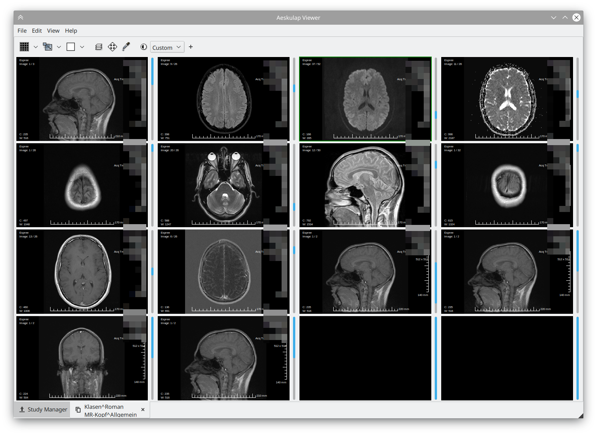
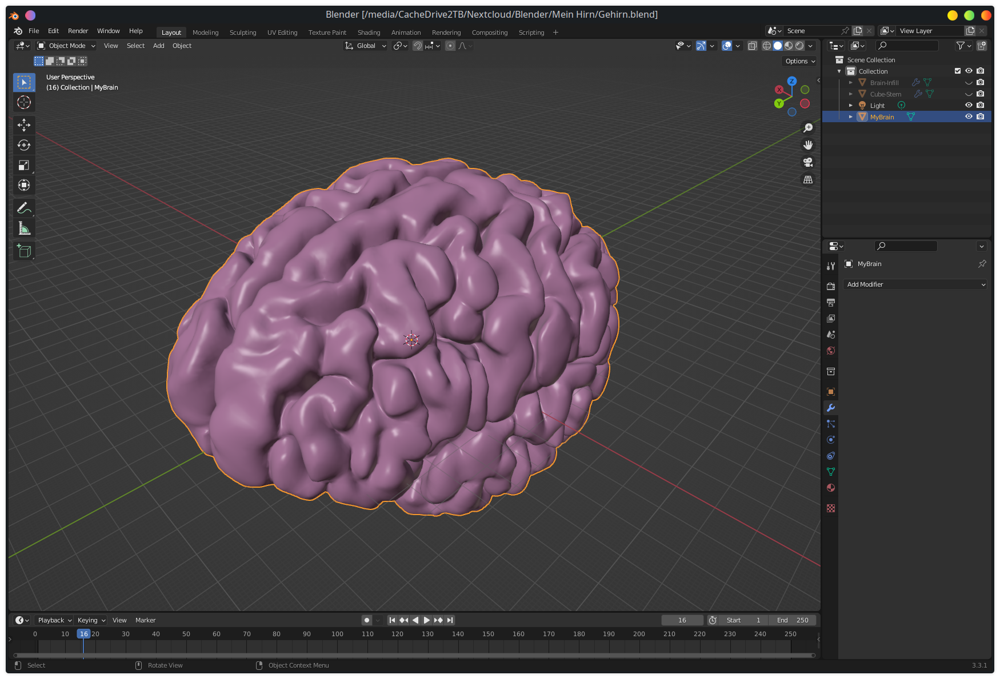
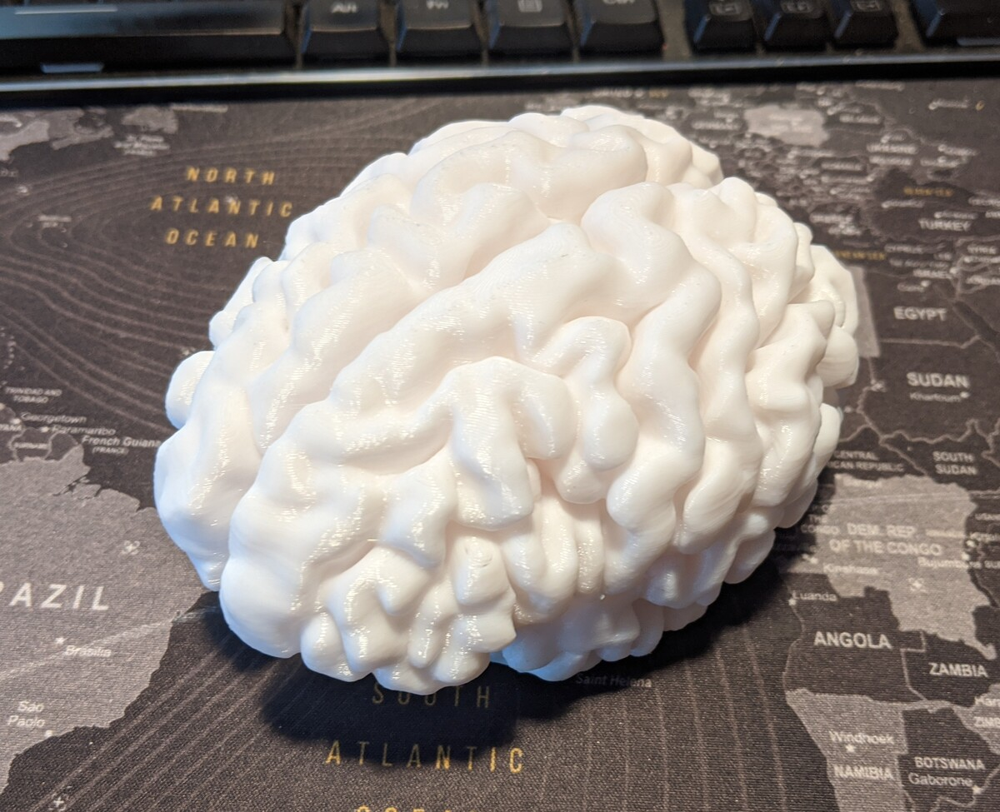

## MRI Scans

See? I have proof!

## Segmentation in Freesurfer

TODO, this is gonna be looooooooooooong.

## Fixing in Blender

I swear I'm not making it bigger.

## Print

~~Almost~~ original color!

# References