# Preamble

Every so often I need to repair a power supply. Most times, I can test them in the context they are used in, like for a computer or a monitor. Sometimes however, I need to test a power supply for which I don't have the actual device it goes in, and for those times a dummy load would come in handy.

Granted, you can simply buy those. But the times when I actually needed one were still too rare to justify spending over 400 Euros for a professional electronic load. Since I like tinkering with electronics, why not build one myself?

After all, all you need is some power dissipating element like a resistor. Okay, ideally I'd like to set how much power should be dissipated, so a transistor is more appropriate. You can adjust the current that should go through it (let's say collector to emitter) by the current you put into it's base (thats pretty much what transistors are for).

You could measure this collector-emitter current somehow with a current sensing resistor, and adjust the base current so that your desired current flows. A micro controller should be just fine for that. Doesn't sound too complicated. Couple of hours probably. Two days tops.

I'm sure I will not have to eat those words.

I whipped up pretty much this a few years ago. The abomination I built back then was mostly improvised. One 2N3055 on a severely under-dimensioned heat sink, an Arduino Nano and a DAC for the base current. No schematic, everything done on the fly and it's a miracle it hasn't gone up in flames yet.

So there is need for a new one.

It did take a few weeks of work though, which is a few weeks more than I anticipated.

## References and Thanks

A huge thank you goes out to [Kerry D. Wong](http://www.kerrywong.com/) who not only knows a lot about electronics (and electronic loads), but also makes fantastic Videos and blog posts. I've learned a lot from him, and I'm sure you will too.

# Design

The first one was quite simple: use a current sensing resistor in the current path and measure the drop voltage with the Arduino Nano's ADC. Then use a DAC to set the base current on the 2N3055 transistor.

This simple design has a few drawbacks:

- the response time is slow, because the uC needs to read the ADC, calculate the new DAC value and set it
- possible oscillations, because the uC is in the feedback loop and dampening would have to be done in software

So this time, I want the current feedback loop to be analog. The uC should only set the DAC and read the ADC. The rest should be done with opAmps. There is a common design for this, in which the opAmp is used as a voltage follower. The current sensing resistor is connected to the inverting input and the DAC to the non-inverting input. The opAmp will then adjust the base current of the transistor to match the voltage on the inverting input with the voltage on the non-inverting input.

Because the ol-reliable LM324 has four op amps in a single package, it seemed sensible to use four current sensing resistors and four transistors in parallel.

I wanted to use as many components that I already have instead of ordering new ones. Opamps and small parts I had laying around, but the only power transistors I have are more of the good old 2N3055. While they are practically indestructible, their TO-3 package makes mounting a bit troublesome. Luckily, I had an old stereo that I wasn't using anymore, so I cannibalized it for transistors and heat sink. I used them with some [TIP120 Darlington transistors](https://en.wikipedia.org/wiki/Darlington_transistor) in a Darlington setting ([dual Darlington](<https://en.wikipedia.org/wiki/Overkill_(term)>), baby!) to switch the base current.

The DAC is an off-brand PCB featuring a MCP4725, the ADC is the very precise and versatile ADS1115 (beware of clones on Amazon/eBay, **many** of the supposed "ADS1115" offerings are actually the 12 bit ADS1110 instead of the 16 bit ADS1115). The display is an SSD1306.

## Schematic

PSU, Arduino, ADC and internal connections are not pictured. The label "AmpMeter" is actually simply the input of the device.

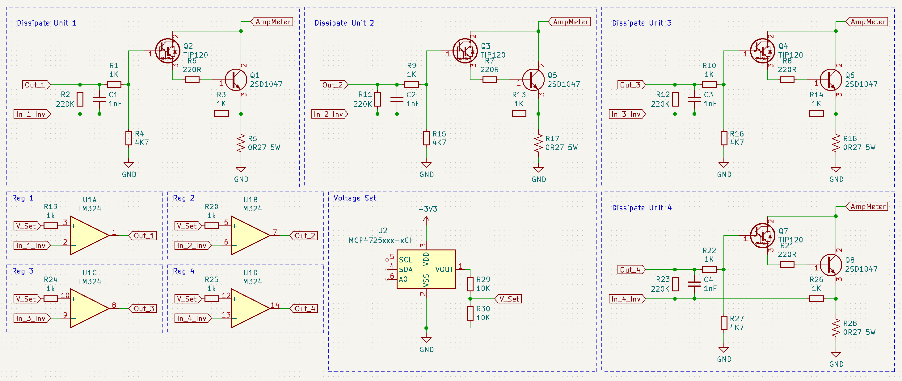

# Building

This is where the fun begins.

## Current Setting Circuit

Transferring the current setting circuit to a proto board is very straight forward. The white JST style connector was for an external potentiometer to test the current setting before the Arduino DAC was ready. To the lower left is an ADS1117 5V linear regulator to step down from the 12V first stage PSU. Take care to select an ADS1117 that can actually tolerate 12V input, as many can not and will release the magic smoke. There are tons of different ADS1117 modules on Amazon/eBay, and many don't even specify if they tolerate 7V, 12V or even 18V.

For that reason, I have completely given up on ADS1117 (yeah I know I should simply buy from a reputable vendor like Digikey or Mouser. I will in the future, I promise), so instead I've switched to using [ST LDL1117](https://www.st.com/en/power-management/ldl1117.html) modules. They are pin compatible with the AMS1117, but can tolerate up to 18V input. On a related note, I've destroyed a few voltage regulators on Arduino/ESP dev boards accidentally, and in those cases I replaced them with these LDL1117 modules.

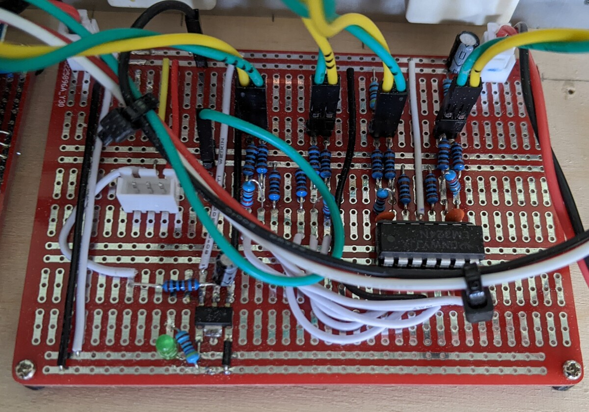

## Mains Voltage PSU

A linear power supply is quite easy to build, all you need are fuses, the right 220V to ~15V transformer, a rectifier and a linear regulator with some capacitors to smooth out the rest. [I have done that on a different project](../inrush-current-limiter), but that was my last print transformer.

Also I didn't want to design my own 220V to 12V switched mode power supply because:

- I don't have the knowledge to do it safely
- So it's hella dangerous
- PSU modules are cheap and readily available
- And I already had a few laying around

This one is for 12V LED lamps and not shoddy diy current sinks, but I won't tell if you don't.

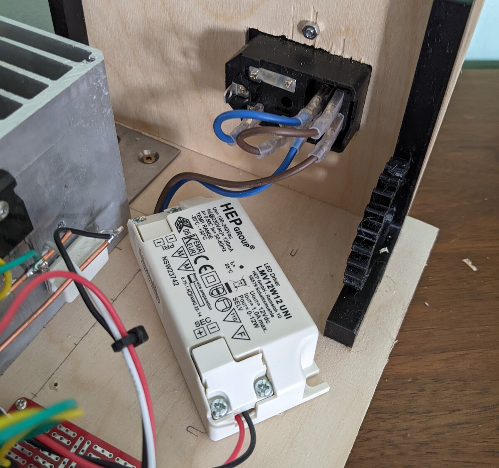

## Micro Controller Board

The heart and brain is a knock off Arduino Nano. I wanted this board separate from the current setting circuit, so that I can replace it with a faster uC if should the need arise (spoiler alert: it did). The Arduino is powered by the 5V from the AMS1117, ADC and DAC are on the same I2C bus. Some voltage dividers are needed because I wanted to measure the input voltage of the current to be set as well as the actual current, so that I can calculate the dissipated power too. And keep my transistors from exploding. The ADC has four inputs, and in my setup:

- One is for the input voltage
- One is for the drop voltage over the current sensing resistor
- One is for the set voltage from the DAC (which was just used during develepment)
- And one is still unused

Current sensing is done at only one of the four current sensing resistors. Don't worry, the analog circuit above still regulates all of four power stages individually, only the micro controller has accesses to only one of the four.

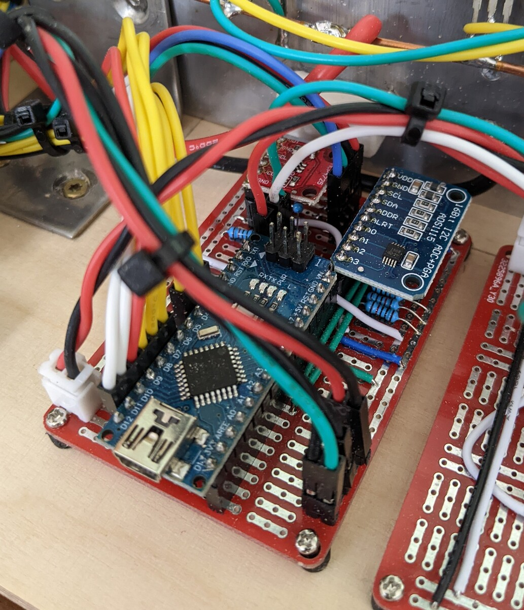

## Front End

The front end features two buttons:

- START/STOP: enables and disables the load
- MODE: cycles through the three modes: constant current, constant resistance and constant power

Commericial electronic loads usually have more modes, like constant voltage, but I don't need that for now. Come to think of it, I haven't used constant resistance or constant power mode yet either. But it's what all the big boys have, so I wanted it too.

Three indicator LEDs show which mode is selected and if the load is enabled. The rotary encoder is used to set the current, resistance or power, depending on the mode.

And of course the display shows the current, voltage, power and equivalent resistance. The display is on the same I2C bus as the ADC and DAC, so I already fear a possible bottleneck. But it works for now.

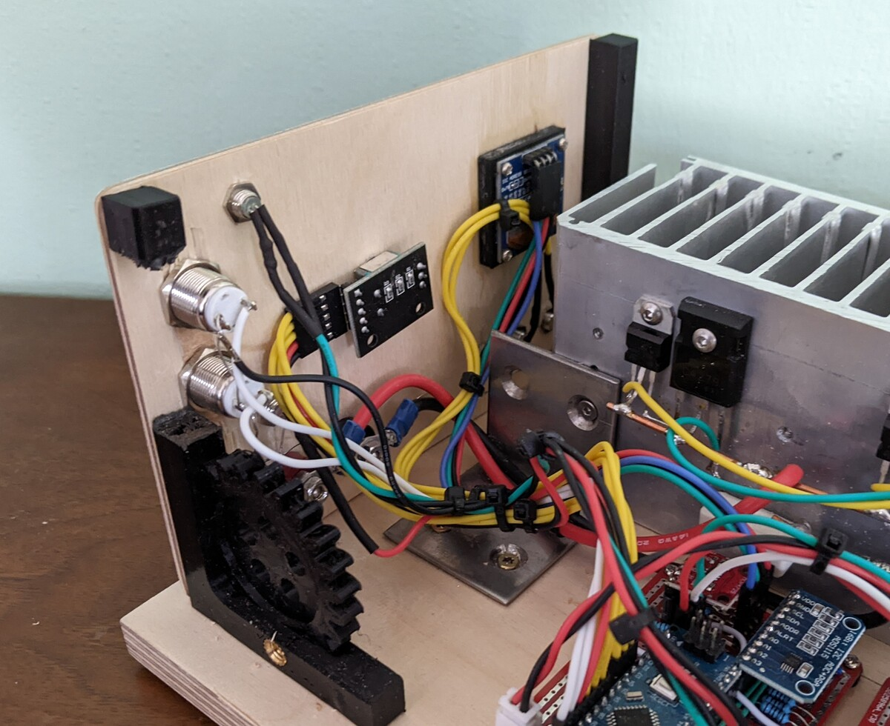

## Power Transistors

Those are cannibalized from an old stereo. For sentimental reasons, I used the heat sink from the stereo as well so they're not alone. I still had to drill new holes and tap new threads since the transistors were in the wrong place.

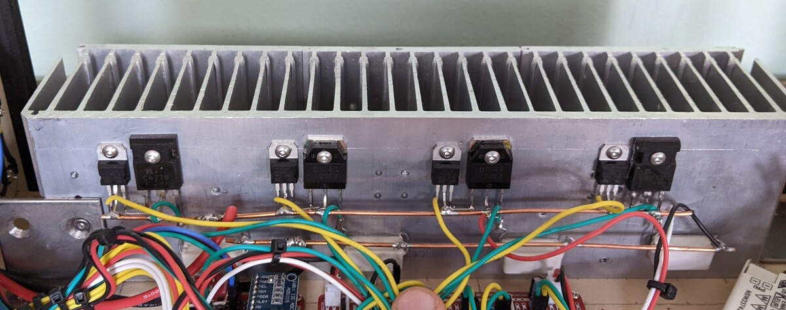

## All of the above

Oh yes. It's all coming together.

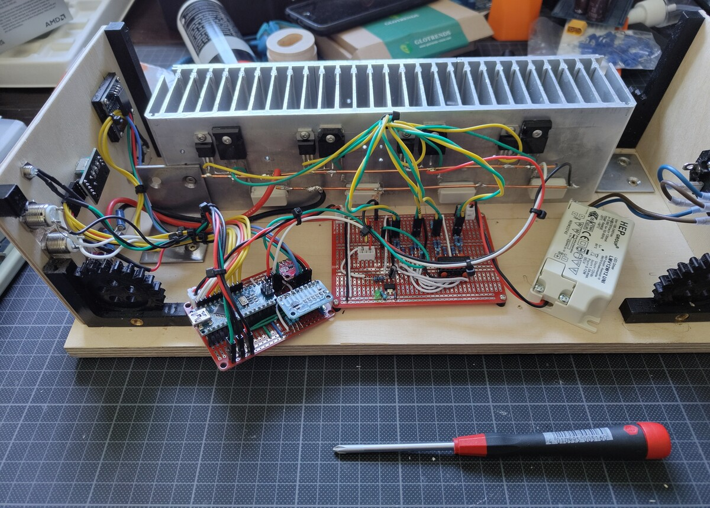

## Calibration

Too see what DAC setting corresponds to what measured current.

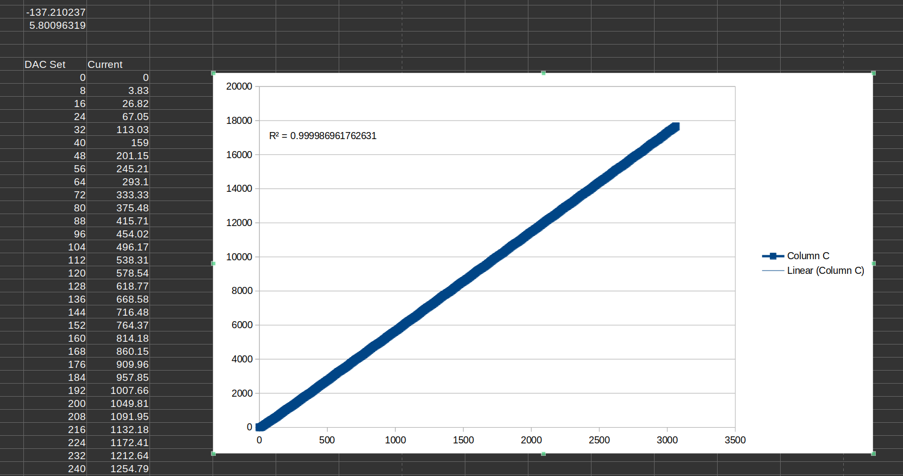

In theory, I should be able to calculate the neccessary DAC setting for a desired current, since the ohmage (is that a real word?) of the current sensing resistor is known. But in practice, the "current sensing" resistor is a cheap and very inaccurate 5% ceramic resistor (because I didn't want to buy new stuff. I mean, you saw that I had basically everything needed already, can you imagine the chaos if were to buy _even more_ stuff? Because I can, and I don't want to). So I had to measure the actual current vs the DAC setting. The DAC setting was determined with a Voltcraft multimeter, the DAC conversion factor goes into the current shunt resistor value. It isn't as stable as I'd hoped, but the measured current from the Voltcraft vs the Arduino ADC is within 50mA. I don't need more precision than that (for now).

## Front Panel

Designed with Inkscape, size made to match a 10cm x 15cm photo paper. Nothing fancy. I used the open source font [B612](https://news.ycombinator.com/item?id=18946601) because I like it and it's open source.

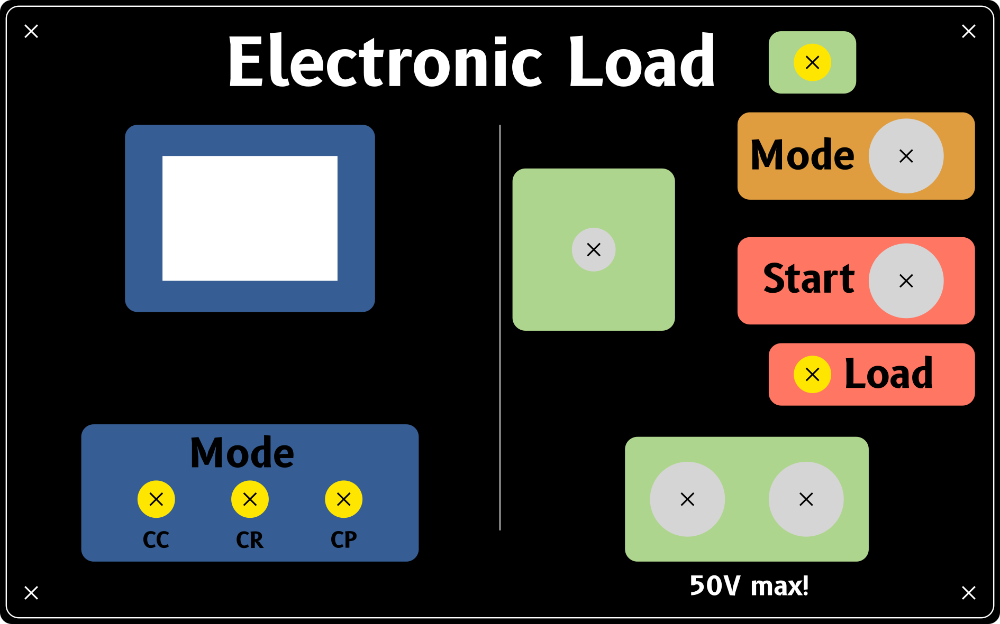

# Enclosure

Time to show off my awesome carpentry skills with an askew plywood box.

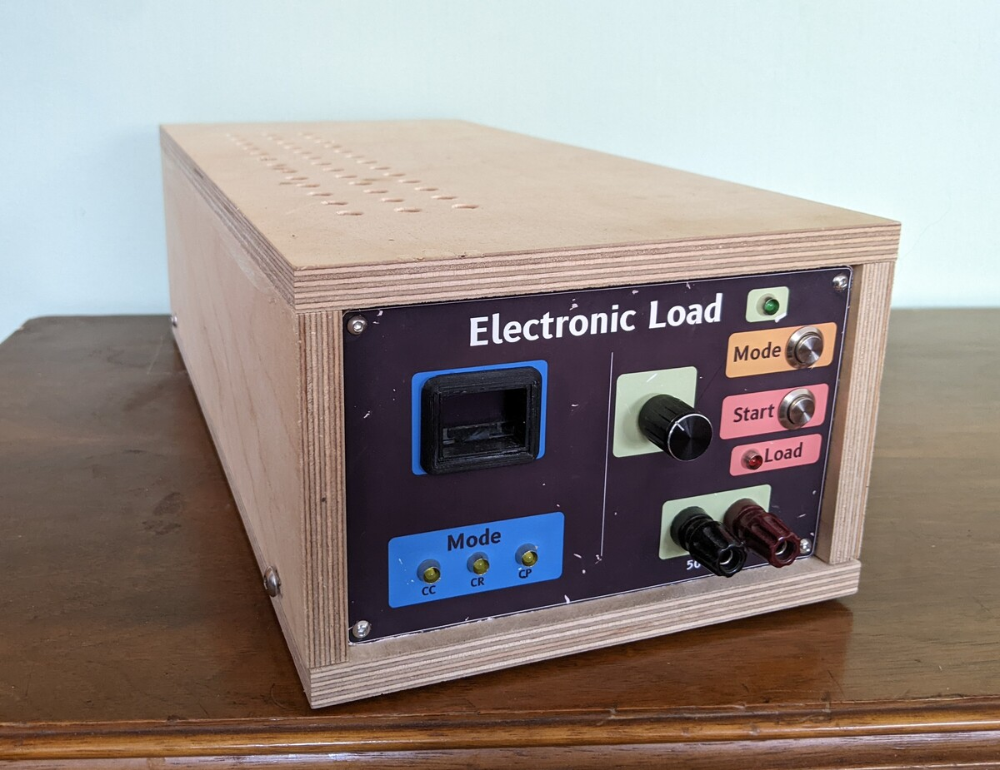
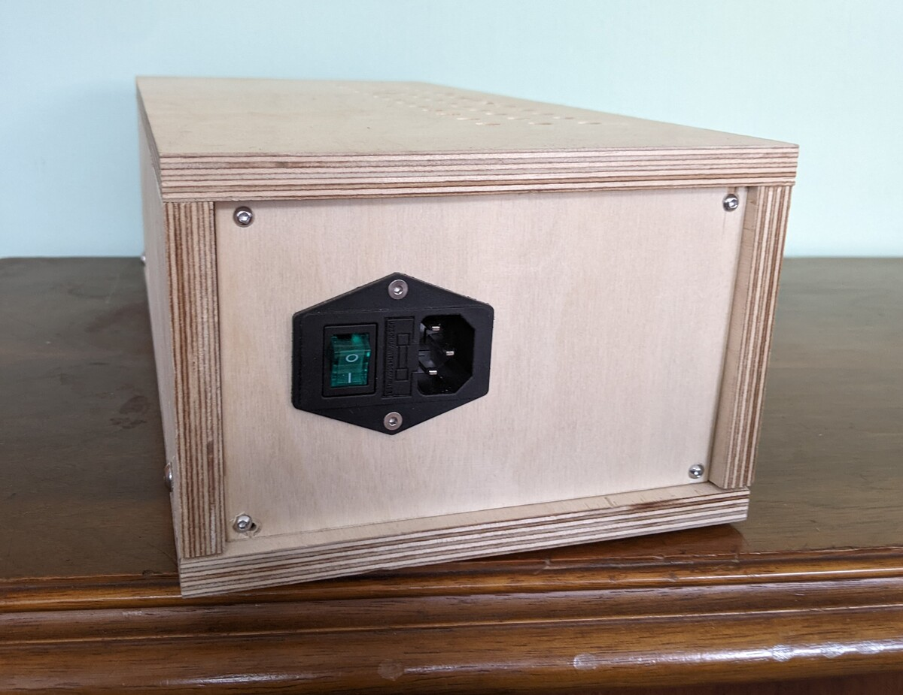
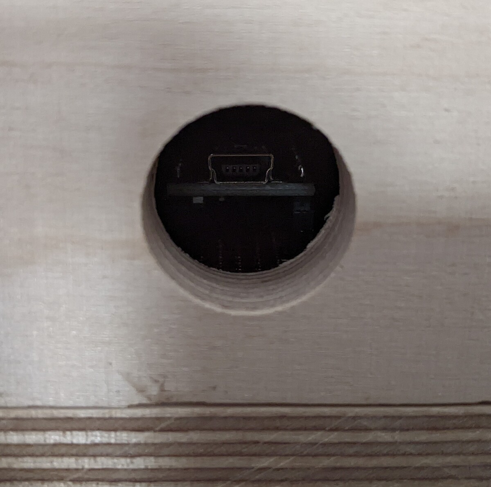

# Test

Right, so I've built it. But does it work? Let's find out!

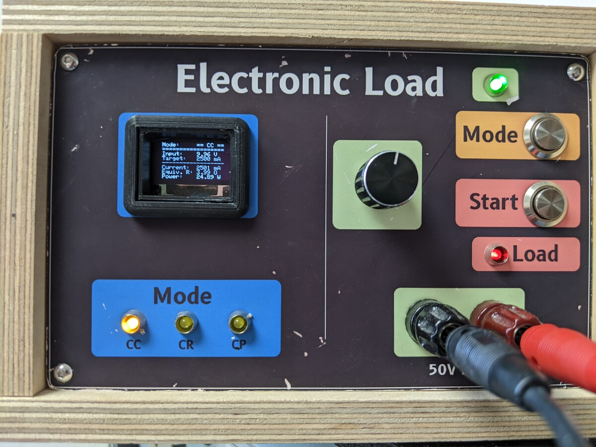
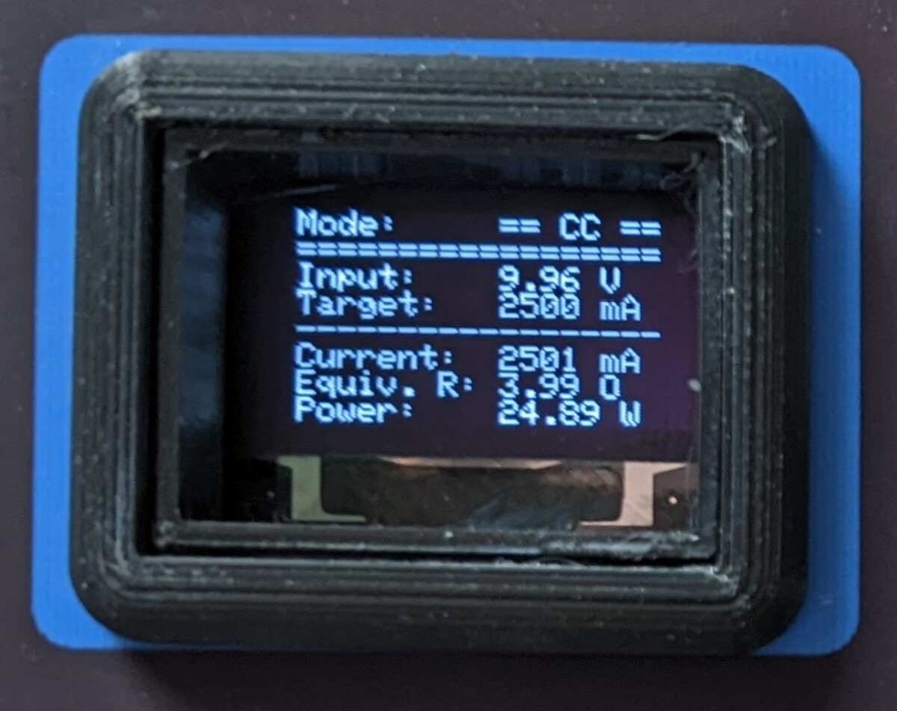

It shows vaguely the same values as my analog power supply (which is a good sign). That's good enough for me.

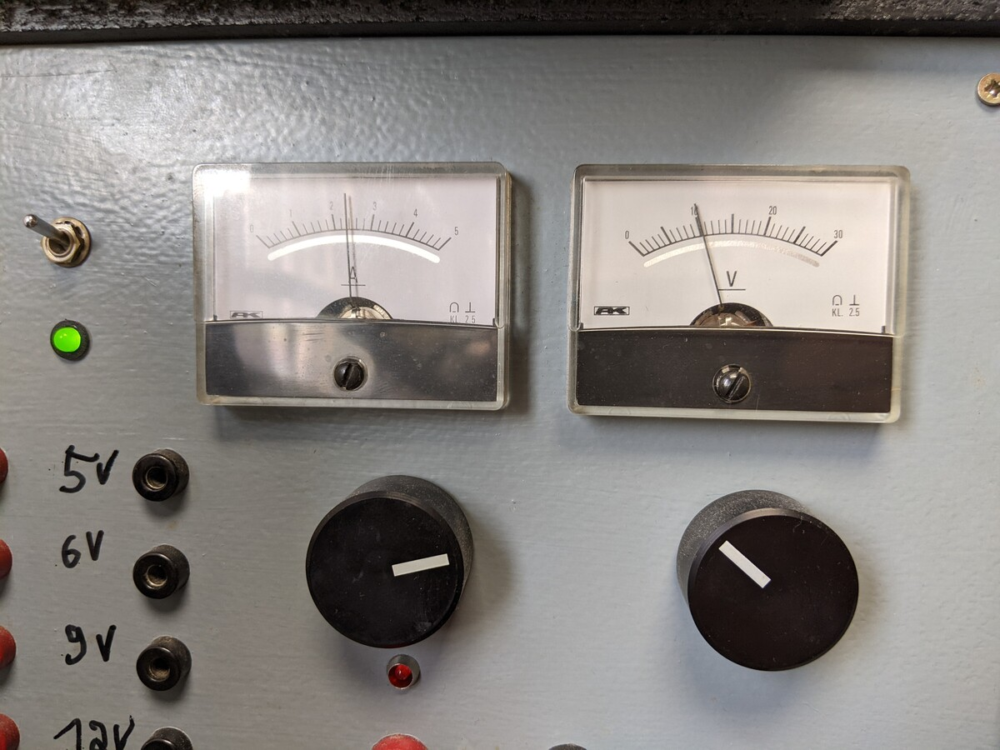

# Code

In the beginning, I really wanted to use [PID](https://en.wikipedia.org/wiki/Proportional%E2%80%93integral%E2%80%93derivative_controller) loop because I've never done that, it seemed interesting and the literature says it's "The Right Thing to Do". Sadly, the atmega328p doesn't have a a lot of memory or storage, and the display code alone consumes already half of it.

Since there wasn't enough room for a proper PID loop, I've made the cave man version: a coarse setting with the linear fit from above and an iterative fine setting that terminates after 32 iterations. I think most PIDs actually need less iterations, but that will just have to wait until I redo the control board with an ESP32 or STM32 (I'm really torn on that, on one hand I really _want_ to try that because it sounds awesome, on the other hand I have a solution that works reasonably well _now_, and I want to actually use it, not improve it in perpetuity).

The ADS1115, MCP4725 and SSD1306 are all Adafruit libraries, which are fantastic if you want results _fast_, so thank you Adafruit for those. The rotary encoder is from [Paul Stoffregen](https://www.pjrc.com/teensy/td_libs_Encoder.html), and the rest is just the standard Arduino stuff.

So, enough rambling, here's the code:

```cpp
#include <Adafruit_ADS1X15.h>
#include <Adafruit_GFX.h>
#include <Adafruit_MCP4725.h>
#include <Adafruit_SSD1306.h>
#include <Arduino.h>
#include <Bounce2.h>
#include <Encoder.h>
#include <Wire.h>
#include <avr/pgmspace.h>
#include <math.h>

//! ---------- Enable Serial Console
// #define SERIAL_ENABLED true
// #define CURRENT_SWEEP true

//* ---------- mode enums
enum OPERATING_MODE { CC_MODE,
                      CR_MODE,
                      CP_MODE };
OPERATING_MODE currentMode;

// this is the state of the load
enum workingState {
    LOAD_DISABLED,
    LOAD_ENABLED,
};

workingState currentState;

//* absolute maximum ratings
#define MAX_CURRENT 25000    // in milli amperes
#define MAX_WATTAGE 125      // in Watts
#define MIN_RESISTANCE 0.25  // in Ohms, so that current doesn't get too high

//* measured constants and hardware properties
#define VinFactor 10.9116                // should be 11:1, but resistors aren't that accurate
#define currentSenseFactor 1.9992        // almost a 50% voltage divider
#define shuntVoltageFactor 1.0           // direct connection
#define currentResistor 0.264775         // experimental value, average of all four
#define milliAmpsSlope 5.800963186       // measured value (nice, that means ~6mA per step!)
#define milliAmpsIntercept -137.2102369  // measured value, inherent to the opAmp construction
#define noOfCurrentChannels 4            // I have this many transistor/resistor channels in parallel

//* LED outputs and button inputs
#define ROT_ENC_CLK 2
#define ROT_ENC_DT 3
#define ROT_ENC_BUTTON 4
#define LED_CC 6
#define LED_CR 7
#define LED_CP 8
#define LED_LOAD 9
#define BUTTON_START 10
#define BUTTON_MODE 11

//* I2C devices
// Adafruit_SSD1306 oled(128, 64, &Wire, -1, 400000, 400000);
Adafruit_SSD1306 oled(128, 64, &Wire, -1);
// U8G2_SSD1306_128X64_NONAME_F_SW_I2C u8g2(U8G2_R0, /* clock=*/SCL, /* data=*/SDA, /* reset=*/U8X8_PIN_NONE);

Adafruit_MCP4725 digitalAnalogConverter;  // 12 bit, so 4096 values
Adafruit_ADS1115 analogDigitalConverter;  // 12 bit (but adjustable amp), so 4096 values
Encoder rotaryEncoder(ROT_ENC_DT, ROT_ENC_CLK);
Bounce2::Button rotaryEncoderButton = Bounce2::Button();
Bounce2::Button modeButton = Bounce2::Button();
Bounce2::Button startButton = Bounce2::Button();

//* dynamic, global variables
double currentSetting = 0.0;      // changed at runtime by user
double currentMeasured = 0.0;     // changed at runtime at explicit measurements
double constantCsetting = 100.0;  // in milli Amperes
double constantRsetting = 100;    // in Ohms
double constantPsetting = 5.0;    // in Watts
double equivalentRsetting = 0.0;  // in Ohms
double powerDissipated = 0.0;     // in Watts
double VINmeasured = 0.0;         // in Volts
double VINmeasuredLast = 0.0;     // in Volts, changed at runtime by calculations
int oldEncoderValue;              // set by the rotary encoder, SINGED integer

//* housekeeping timers
unsigned long now;
unsigned long updateDisplayInterval = 1000;  // in millis
unsigned long lastDispTime = 0;

//* ---------- forward declared functions
void display_update();
// void display_updateU8g2();
void currentSweep();
void welcomeScreen();
void loadStatusScreen();                                      // updates display (no measurements or calculations)
void setCurrent();                                            // sets current from global variable
void measureVoltage();                                        // reads VIN and stores to global variable
void measureCurrent();                                        // reads current and stores to global variable
bool checkInput();                                            // checks if there is a voltage > 1V at input
bool encoderChanged();                                        // return true when the encoder changes, update set values (C, R, P)
bool inputChanged();                                          // check if VIN has changed (50mV) since last time
inline uint16_t milliAmpsToDAC(uint16_t milliAmps);           // converts linear fit for DAC setting
inline double dacToMilliAmps(uint16_t dacValue);              // converts linear fit for DAC setting
inline double getTargetCurrent(OPERATING_MODE selectedMode);  // linear fit

//* ---------- functions to set internal variables
void CCmode();       // sets current
void CRmode();       // sets current by resistance
void CPmode();       // sets current by power
void setLoad();      // in milli Amperes
void disableLoad();  // this also disables the current!

//! ---------- actual code

void setup(void) {
#ifdef SERIAL_ENABLED
    Serial.begin(115200);
    Serial.println("Greetings, human!");
#endif

    // now is startup time
    now = millis();
    // reset timer for first update
    // lastDispTime = 0;
    // lastSetTime = 0;

    // ---------- Setup DAC
    digitalAnalogConverter.begin(0x60);
    digitalAnalogConverter.setVoltage(0, false);

    // ---------- Setup ADC
    analogDigitalConverter.begin(0x48);
    analogDigitalConverter.setDataRate(RATE_ADS1115_64SPS);

    // ---------- Setup Display
    oled.begin(SSD1306_SWITCHCAPVCC, 0x3C);
    oled.clearDisplay();
    oled.display();
    // u8g2.begin();

    // ---------- setup LEDs and buttons
    pinMode(ROT_ENC_CLK, INPUT_PULLUP);
    pinMode(ROT_ENC_DT, INPUT_PULLUP);
    // pinMode(ROT_ENC_BUTTON, INPUT_PULLUP); // not needed for bounce2
    pinMode(LED_CC, OUTPUT);
    pinMode(LED_CR, OUTPUT);
    pinMode(LED_CP, OUTPUT);

    rotaryEncoderButton.attach(ROT_ENC_BUTTON, INPUT_PULLUP);
    rotaryEncoderButton.interval(5);
    rotaryEncoderButton.setPressedState(LOW);

    modeButton.attach(BUTTON_MODE, INPUT_PULLUP);
    modeButton.interval(5);
    modeButton.setPressedState(LOW);

    startButton.attach(BUTTON_START, INPUT_PULLUP);
    startButton.interval(5);
    startButton.setPressedState(LOW);

    // ---------- set default values
    // read from EEPROM from last time

    constantCsetting = 1000;
    constantRsetting = 10;
    constantPsetting = 15;

    equivalentRsetting = 999;
    powerDissipated = 0.0;

    // welcomeScreen();
    // delay(5000);

    // we always start in CC mode
    currentState = LOAD_DISABLED;
    CCmode();
}

// TODO: add buttons, LEDs and Encoder (https://www.arduino.cc/reference/en/libraries/encoder/)

void loop() {
// for slope and intercept measurements of the current setting circuit
#ifdef currentSweep
    currentSweep();
    return;
#endif

    //! ---------- we ALWAYS need up to date voltage, current and timing info
    now = millis();
    measureCurrent();

    // update all buttons
    rotaryEncoderButton.update();
    modeButton.update();
    startButton.update();

    //! ---------- and if the voltage or settings changed, the current needs to be adjusted
    if ((inputChanged() || encoderChanged())) {
        currentSetting = getTargetCurrent(currentMode);
        if (currentState == LOAD_ENABLED) {
            setCurrent();
        }
    }

    //! ---------- toggle load on and off
    if (startButton.pressed()) {
        switch (currentState) {
            case LOAD_DISABLED:
                setLoad();
                break;
            case LOAD_ENABLED:
                disableLoad();
                break;
            default:
                disableLoad();
        }
    }

    //! ---------- read if user wants mode changed.
    if (modeButton.pressed()) {
        disableLoad();
        switch (currentMode) {
            case CC_MODE:
                CRmode();
                break;
            case CR_MODE:
                CPmode();
                break;
            case CP_MODE:
                CCmode();
                break;
        }
    }

    // check for rotary button changes, better number input
    if (rotaryEncoderButton.pressed()) {
        // Serial.println("button pressed lol");
    }

    //! ---------- display measurements
    if (now > (lastDispTime + updateDisplayInterval)) {
        lastDispTime = now;
        // display_updateU8g2();
        display_update();
    }
}

double getTargetCurrent(OPERATING_MODE selectedMode) {
    switch (selectedMode) {
        case CC_MODE:
            return constantCsetting;
        case CR_MODE:
            return currentSetting = (VINmeasured / constantRsetting) * 1000;
        case CP_MODE:
            return currentSetting = (constantPsetting / VINmeasured) * 1000;
    }
    return 0.0;
}

void setLoad() {
    currentState = LOAD_ENABLED;
    digitalWrite(LED_LOAD, HIGH);
    currentSetting = getTargetCurrent(currentMode);
    setCurrent();
    return;
}

void disableLoad() {
    currentState = LOAD_DISABLED;
    digitalWrite(LED_LOAD, LOW);
    digitalAnalogConverter.setVoltage(0, false);
    return;
}

void CCmode() {
    currentMode = CC_MODE;
    digitalWrite(LED_CC, HIGH);
    digitalWrite(LED_CR, LOW);
    digitalWrite(LED_CP, LOW);
}

// in CR mode, voltage must be connected before start!
void CRmode() {
    currentMode = CR_MODE;
    digitalWrite(LED_CC, LOW);
    digitalWrite(LED_CR, HIGH);
    digitalWrite(LED_CP, LOW);
}

// in CP mode, voltage must be connected before start!
void CPmode() {
    currentMode = CP_MODE;
    digitalWrite(LED_CC, LOW);
    digitalWrite(LED_CR, LOW);
    digitalWrite(LED_CP, HIGH);
}

bool inputChanged() {
    measureVoltage();
    if (abs(VINmeasuredLast - VINmeasured) > 0.050) {
        VINmeasuredLast = VINmeasured;
        return true;
    }
    return false;
}

bool checkInput() {
    measureVoltage();
    if (VINmeasured < 1.0) {
        digitalAnalogConverter.setVoltage(0, false);
        measureCurrent();
        return false;
    }
    return true;
}

bool encoderChanged() {
    bool returnVal = false;

    if (rotaryEncoder.read() > oldEncoderValue + 3) {
        oldEncoderValue = rotaryEncoder.read();
        switch (currentMode) {
            case CC_MODE:
                constantCsetting += 50;
                break;
            case CR_MODE:
                constantRsetting += 0.25;
                break;
            case CP_MODE:
                constantPsetting += 1.0;
                break;
        }
        returnVal = true;
    } else if (rotaryEncoder.read() < oldEncoderValue - 3) {
        oldEncoderValue = rotaryEncoder.read();
        switch (currentMode) {
            case CC_MODE:
                constantCsetting -= 50;
                break;
            case CR_MODE:
                constantRsetting -= 0.25;
                break;
            case CP_MODE:
                constantPsetting -= 1.0;
                break;
        }
        returnVal = true;
    }

    constantCsetting = constrain(constantCsetting, 0, MAX_CURRENT);
    constantRsetting = constrain(constantRsetting, MIN_RESISTANCE, 100);
    constantPsetting = constrain(constantPsetting, 0.0, MAX_WATTAGE);

    return returnVal;
}

#ifdef currentSweep
void currentSweep() {
    Serial.println("Get ready...");
    delay(10000);
    for (uint16_t iDac = 0; iDac < 3072; iDac += 8) {
        digitalAnalogConverter.setVoltage(iDac, false);
        currentSetting = dacToMilliAmps(iDac);
        delay(50);  // let current settle
        measureCurrent();
        Serial.print(iDac);
        Serial.print(",");
        Serial.println(currentMeasured);
    }
    Serial.println("Done!");
    delay(10000);
}
#endif

void setCurrent() {
    // settings below 25mA are too unreliable, disable
    if (currentSetting < 25) {
        disableLoad();
        return;
    }

    // calculate MAX RATINGS
    equivalentRsetting = VINmeasured / (currentSetting / 1000);
    powerDissipated = VINmeasured * (currentSetting / 1000);

    // the order is important here! current may exceed max current even if below power budget
    if (equivalentRsetting < MIN_RESISTANCE) {
        currentSetting = (VINmeasured / MIN_RESISTANCE) * 1000;  // remember milli amperes
    }
    if (powerDissipated > MAX_WATTAGE) {
        currentSetting = (MAX_WATTAGE / VINmeasured) * 1000;  // remember milli amperes
    }
    if (currentSetting > MAX_CURRENT) {
        currentSetting = MAX_CURRENT;
    }

    // only set if there is voltage
    if (!checkInput()) {
        // equivalentRsetting = VINmeasured / (currentMeasured / 1000);
        // powerDissipated = VINmeasured * (currentMeasured / 1000);
        return;
    }

    uint8_t numTries = 0;  // less than 8 bit=256 I hope!
    uint16_t currentDACsetting = milliAmpsToDAC(currentSetting);
    digitalAnalogConverter.setVoltage(currentDACsetting, false);
    delay(2);  // wait a little for current to settle
    measureCurrent();

    // then measure and adjust, seems to be some hysteresis here
    for (uint8_t iTries = 0; iTries < 32; iTries++) {
        // within tolerance? return!
        if (abs(currentMeasured - currentSetting) < milliAmpsSlope / 2) {
#ifdef SERIAL_ENABLED
            Serial.print("Current set, took ");
            Serial.print(numTries);
            Serial.println(" tries.");
            Serial.print("Error: ");
            Serial.print(abs(currentMeasured - currentSetting));
            Serial.println("mA");
#endif
            equivalentRsetting = VINmeasured / (currentMeasured / 1000);
            powerDissipated = VINmeasured * (currentMeasured / 1000);

            currentState = LOAD_ENABLED;
            return;
        } else if (currentMeasured > currentSetting) {
            currentDACsetting -= 1;
        } else if (currentMeasured < currentSetting) {
            currentDACsetting += 1;
        }
        // settings updated
        numTries++;
        digitalAnalogConverter.setVoltage(currentDACsetting, false);
        delay(1);  // wait a little for current to settle
        measureCurrent();
    }

    equivalentRsetting = VINmeasured / (currentMeasured / 1000);
    powerDissipated = VINmeasured * (currentMeasured / 1000);
}

void measureCurrent() {
    // we can get more precise measurements with a higher pre amp setting. but that depends on the current we expect.
    // start with highest expectation and work to lower currents
    // the ADC can measure up to 6.144V when on TWO_THIRDS scale and 0.256 at SIXTEEN

    // int16_t readVal;
    double readVal;

    if (currentSetting > 7200 * noOfCurrentChannels) {
        analogDigitalConverter.setGain(GAIN_ONE);
    } else if (currentSetting <= 7200 * noOfCurrentChannels && currentSetting > 3600 * noOfCurrentChannels) {
        analogDigitalConverter.setGain(GAIN_TWO);
    } else if (currentSetting <= 3600 * noOfCurrentChannels && currentSetting > 1800 * noOfCurrentChannels) {
        analogDigitalConverter.setGain(GAIN_FOUR);
    } else if (currentSetting <= 1800 * noOfCurrentChannels && currentSetting > 900 * noOfCurrentChannels) {
        analogDigitalConverter.setGain(GAIN_EIGHT);
    } else if (currentSetting <= 900 * noOfCurrentChannels) {
        analogDigitalConverter.setGain(GAIN_SIXTEEN);
    }
    // this is the actual voltage from the ADC
    readVal = analogDigitalConverter.readADC_SingleEnded(1);
    readVal = analogDigitalConverter.computeVolts(readVal) * shuntVoltageFactor;

    if (readVal < 0) {
        readVal = 0;
    }
    currentMeasured = (double(readVal * noOfCurrentChannels) / currentResistor) * 1000.0;
}

void measureVoltage() {
    analogDigitalConverter.setGain(GAIN_ONE);

    double readVal;

    readVal = analogDigitalConverter.readADC_SingleEnded(3);
    readVal = analogDigitalConverter.computeVolts(readVal) * VinFactor;

    if (readVal < 0) {
        readVal = 0;
    }
    VINmeasured = readVal;
}

void display_update() {
    oled.clearDisplay();
    oled.setCursor(0, 0);
    oled.setTextSize(1);
    oled.setTextColor(WHITE);

    oled.print("  Mode:     ");
    switch (currentMode) {
        case CC_MODE:
            oled.println("== CC ==");
            break;
        case CR_MODE:
            oled.println("++ CR ++");
            break;
        case CP_MODE:
            oled.println("-- CP --");
            break;
        default:
            break;
    }

    oled.println("  ==================");

    oled.print("  Input:    ");
    oled.print(VINmeasured);
    oled.println(" V");

    oled.print("  Target:   ");
    switch (currentMode) {
        case CC_MODE:
            oled.print(int(constantCsetting));
            oled.println(" mA");
            break;
        case CR_MODE:
            oled.print(constantRsetting);
            oled.println(" O");
            break;
        case CP_MODE:
            oled.print(constantPsetting);
            oled.println(" W");
            break;
        default:
            break;
    }

    oled.println("  ------------------");

    oled.print("  Current:  ");
    oled.print(int(currentMeasured));
    oled.println(" mA");
    oled.print("  Equiv. R: ");
    oled.print(equivalentRsetting);
    oled.println(" O");
    oled.print("  Power:    ");
    oled.print(powerDissipated);
    oled.println(" W");

    oled.display();
}

uint16_t milliAmpsToDAC(uint16_t milliAmps) {
    return (milliAmps - milliAmpsIntercept) / milliAmpsSlope;
}

double dacToMilliAmps(uint16_t dacValue) {
    return (dacValue * milliAmpsSlope + milliAmpsIntercept);
}
```
