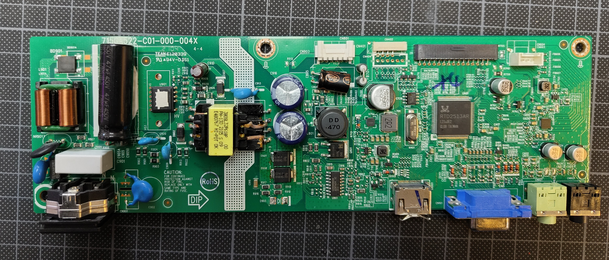
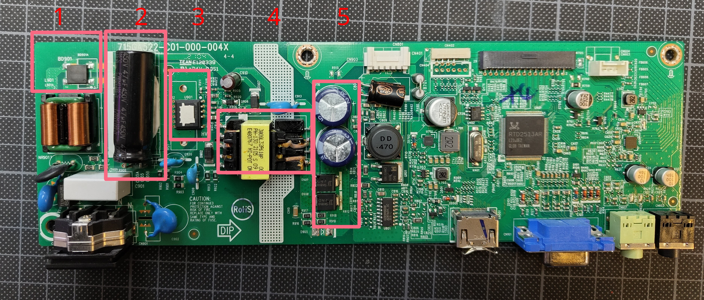
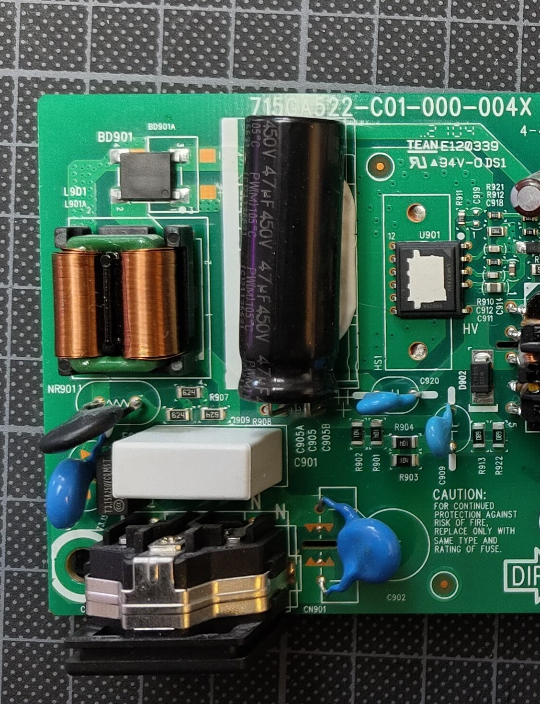
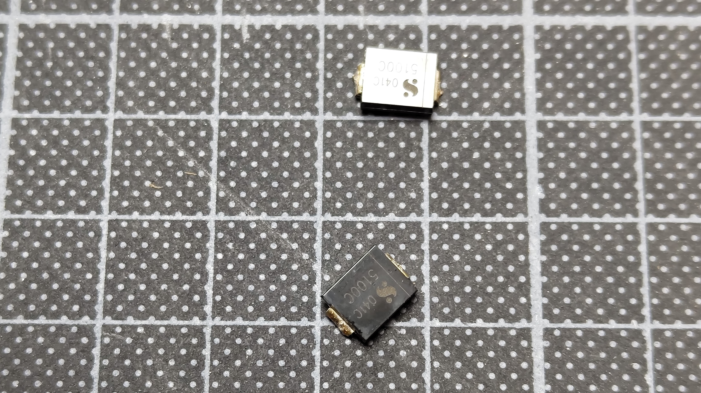
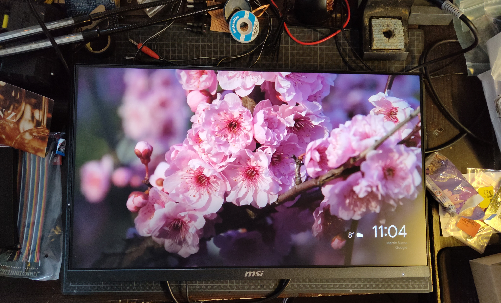

# Preamble

Every so often I obtain through some means a broken monitor. This time, my brother in law gave me one to repair. I don't even remember the exact model, so let's just use this image from Wikipedia, credit to [Uwe Aranas](https://en.wikipedia.org/wiki/File:Monitor-Eizo-CG277-BK-27inches-01.jpg):

The exact model doesn't even matter, because this seems to be a common issue. And because it's such a common occurrence, maybe this blog post will help somebody repair their own monitor.

## References and Thanks

Thanks go out to [Louis Rossmann](https://www.youtube.com/channel/UCl2mFZoRqjw_ELax4Yisf6w) and [Phil Salmony](https://www.youtube.com/@PhilsLab), because they teach electronics in a very approachable way.

## The Problem

The monitor just did not turn on. No lights, no nothing. A couple of snapped plastic clips later, I had the monitor open:

Not much on the back side.

## Switching Power Supply Basics

The interesting bits are on the front side anyway. The PCB has a very tidy layout: The primary side of the switching power supply is to the left, to the right we can see the HDMI VGA inputs and the LVDS output to the actual LCD. The main transformer is directly above the white separating line. To the right of it are rectifying diodes and a DC-DC stage.

Switch mode power supplies are very common in electronics. They are used to convert a high voltage AC input to a low voltage DC output.

The process is pretty much always:

- Rectify the 50 Hz /230 volts AC input to DC (about 300 Volts)
- Chop that on/off at a high frequency (15 kHz to 150 kHz)
- Tansform that to a lower voltage
- Rectify and smooth that to DC

Because the transformable power is proportional to the AC frequency, the high frequency chopping allows for a much smaller transformer, which is why they are used in almost all electronics.

- 1: Primary Side AC Rectifier
- 2: Primary Side Capacitor
- 3: PWM-Controller / Chopper. Many times these are separate components, but on here it's integrated into one IC, which is kinda neat!
- 4: Transformer
- 5: Secondary Side Rectifier And Capacitors
- Rest: DC-DC stage for DMI to LVDS signal processing magic

This is the part where the reader is warned about the dangers of working with mains voltage. Especially the large capacitor to the left stores a lot of energy **at high voltage**.

It may as well try to kill you, so make sure it's discharged before you touch anything. The capacitor smooths out rectified 230 volts, so about 300 volts. So again, I always measure it's leads to make sure it's discharged before I touch anything.

## My usual Diagnosis

I usually start by looking for obvious damage, like bulging capacitors or burnt components. Many times, the capacitors are the culprit. This time, however, they looked fine.

When no components are obviously broken, I try to test some voltages. This has to be done with applied mains voltage however, so from now on, extra caution is required.

- First, I check the primary side DC at the killer capacitor.
  - If it's there, proceed to the PWM controller
  - It not, something is broken upstream, like the first AC rectifier, fuses etc.
- The HV DC voltage was present, so I moved to the PWM controller. Since it chops, AC measurement is needed.
  - If no HV AC can be measured here, either the PWM controller is broken or disabled by the secondary side. Some power supplies have multiple step down stages and only enable the larger stage if the monitor is turned on. The small stage then only supplies enough power for stand by functionality. This makes debugging a bit harder, but thankfully, this power supply has only one stage.
  - If HV AC is present, the PWM controller is working and I check the transformer.
- On the secondary side, we can check the transformed AC voltage and rectified DC voltage, and this is where the problem was.

It was best seen on the rectifying diodes. The voltage kept jumping between 0 and 15 volts. This is a clear sign of a short circuit somewhere. The PWM controller attempts to set voltage, sees a large current and shuts down due to over current protection, over and over again.

So the short circuit has to be on the secondary side somewhere. Usually, I go from easiest-to-fix to hardest-to-fix:

- Capacitors
- Diodes
- DC-DC stage
- Signal Processor IC

The capacitors were fine, but the diodes were shorted. So there was no need to check the DC-DC stage or the signal processor.

Well, one of them was, but I'm switching both out anyway.

## Success

To test, I usually just plug in an old Chromecast.

# 🎉
